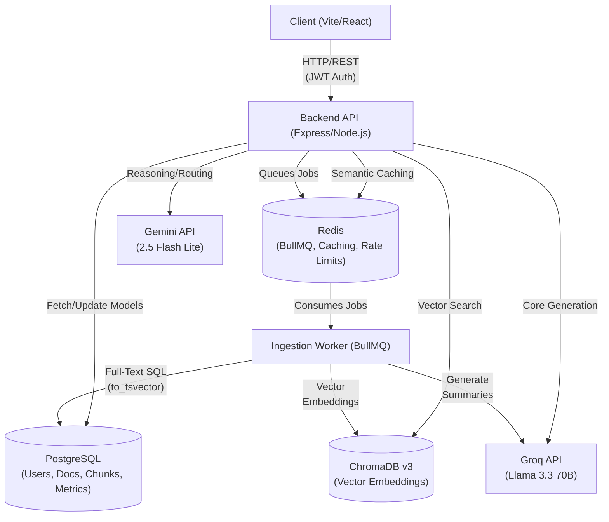
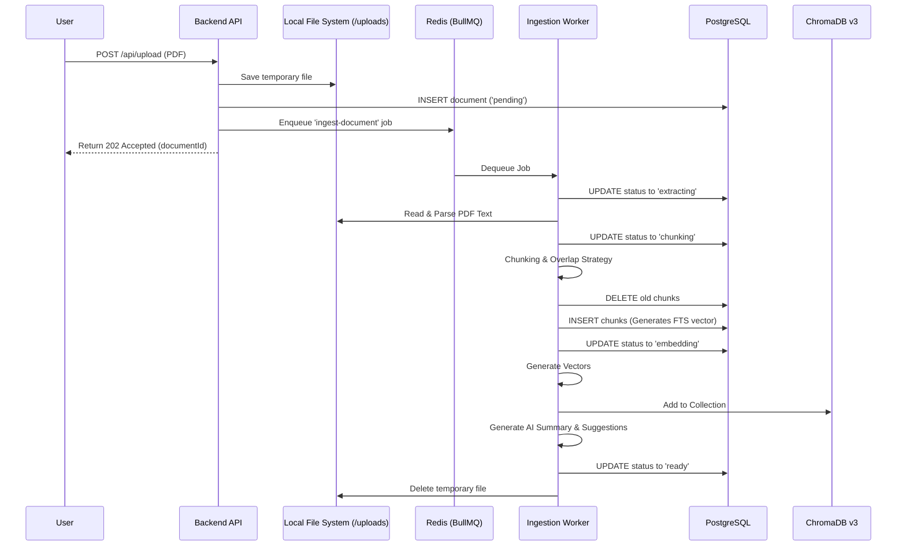
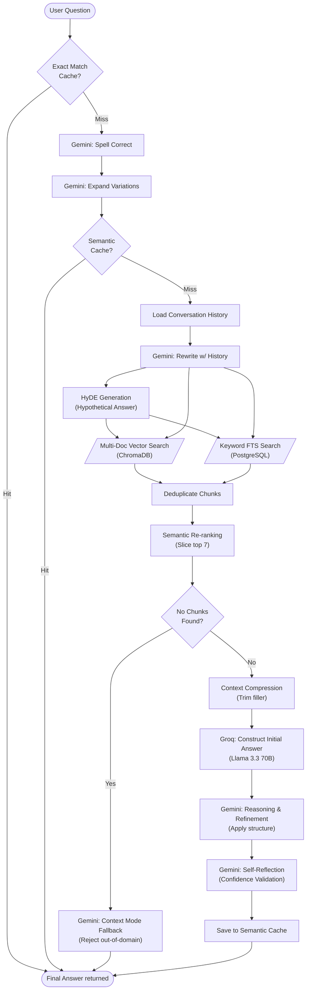

# NexaSense AI Assistant: Architecture & Documentation

Welcome to the **NexaSense AI Assistant** repository. NexaSense is an enterprise-grade, highly scalable Document Intelligence system built to process, search, and intelligently converse with multiple documents simultaneously using an advanced Retrieval-Augmented Generation (RAG) architecture.

This README provides a fully explanatory breakdown of the system architecture, the technology stack, and instructions on how to run the project.

---

## 🌟 High-Level Overview

<div align="center">
  
</div>

NexaSense effectively does two main things:
1. **Asynchronous Ingestion**: Securely processes large PDF files in the background, extracting, chunking, and translating human text into multi-dimensional mathematical vectors.
2. **Intelligent Querying (RAG)**: Employs a sophisticated multi-stage retrieval pipeline backed by a **Dual-LLM Design** (Llama 3.3 70B via Groq + Gemini 2.5 Flash Lite) to find the exact paragraphs needed to answer a user's question, strictly preventing hallucinations.

---

## 🏗️ Detailed Architecture Flow

The system architecture is decoupled into **four primary tiers**: Frontend, Backend API, asynchronous Worker, and the Data Storage Layer.

### 1. System Architecture Overview
This diagram illustrates the high-level decoupled architecture and data flow between the services.



### 2. Data Storage & Infrastructure Layer
- **PostgreSQL**: The relational backbone of the system. It scales user data, conversation histories, system telemetry/metrics, and the raw text chunks. 
  - *Feature Highlight*: Contains an automated SQL trigger that calculates a `to_tsvector` (search vector) on every raw text chunk inserted. This provides high-speed full-text keyword search directly at the database level.
- **ChromaDB (v3)**: The vector database. Responsible solely for storing floats (embeddings) and performing instantaneous Cosine Similarity distance calculations to find semantically relevant chunks.
- **Redis**: The in-memory cache. Used for BullMQ queues, rate-limit tracking, and high-speed semantic query caching.

### 3. The Ingestion Pipeline (BullMQ Worker)
When a user uploads a PDF, the main API does *not* process it. Instead, the API saves the file to `/uploads`, marks the document as `pending` in PostgreSQL, and enqueues a job into Redis.



The dedicated worker (`ingestion.worker.js`) executes the Background Job:
1. **Extraction**: Uses robust parsers to strip readable text from the encoded PDF.
2. **Semantic Chunking**: Slices the document into overlapping chunks (e.g., 500-1000 characters) to ensure context doesn't abruptly cut off mid-sentence.
3. **Embedding**: Transforms every chunk into an embedding vector using the centralized `sharedEmbedder` singleton to optimize memory.
4. **Dual Storage**: Saves the raw text and metadata into PostgreSQL, and the vector embeddings into ChromaDB.
5. **Cleanup**: Automatically deletes the temporary PDF from the local file system and marks the document `ready`.

*Note*: If a failure occurs (e.g. network timeout), BullMQ automatically retries the job with an exponential backoff.

### 4. The Retrieval Pipeline (RAG)
When a user asks a question, the backend routes the query through an intensive multi-step pipeline (`retrieval.pipeline.js`):



---

## 📂 Project Structure

```text
nexasense/
├── src/                        # Backend Source Code
│   ├── cache/                  # Semantic & Query Caching logic
│   ├── config/                 # Database, Redis & Chroma configurations
│   ├── controllers/            # API Route handlers
│   ├── db/                     # Database connection & schema setup
│   ├── middleware/             # Auth & File Upload middlewares
│   ├── pipelines/              # Core RAG Retrieval Pipeline orchestrator
│   ├── queue/                  # BullMQ ingestion queue setup
│   ├── routes/                 # Express API routes
│   ├── services/               # AI (Gemini/Groq), Search, & Logic services
│   ├── utils/                  # Shared helper functions & Logger
│   ├── workers/                # Background Ingestion Worker
│   ├── app.js                  # Main Express application setup
│   └── server.js               # Backend Entry Point
├── frontend/                   # React (Vite) Frontend Application
│   ├── src/
│   │   ├── pages/              # UI Pages (Chat, Dashboard, Login, etc.)
│   │   ├── components/         # Reusable UI components
│   │   ├── hooks/              # Custom React hooks (useApi, useStream)
│   │   └── services/           # Frontend API communication
│   ├── public/                 # Static assets
│   ├── Dockerfile              # Frontend Container setup
│   └── vite.config.js          # Vite & Proxy configuration
├── uploads/                    # Temporary staging for uploaded PDFs
├── logs/                       # Persistent application logs
├── schema.sql                  # PostgreSQL Schema with FTS Triggers
├── Dockerfile                  # Main Node.js (Backend/Worker) Container setup
├── docker-compose.yml          # Full-stack Container Orchestration
└── .env.example                # Example environment configuration
```

---

## 🛠️ Technology Stack Breakdown

| Layer | Technology |
| :--- | :--- |
| **Frontend UI** | React.js, Vite, Tailwind CSS |
| **Web API / Worker** | Node.js, Express.js |
| **Relational Database** | PostgreSQL |
| **Vector Database** | ChromaDB (v3 compatible) |
| **Caching & Queues** | Redis, BullMQ |
| **Primary LLM** | Meta Llama 3.3 70B (via Groq API) |
| **Reasoning Agent** | Google Gemini 2.5 Flash Lite |

---

## 🚀 Quick Setup & Deployment

### 1. Docker Deployment (Recommended)
NexaSense is heavily optimized for zero-configuration containerized deployment via Docker.

```bash
# 1. Clone the repository
git clone https://github.com/rajakumar123-commit/nexasense-ai-assistant.git
cd nexasense-ai-assistant

# 2. Configure environment
cp .env.example .env
# Edit .env and insert your GEMINI_API_KEY and GROQ_API_KEY

# 3. Bring the stack online
docker compose up --build -d
```

### 2. Manual Startup (Development)
If you prefer running components individually on your local machine:

**Backend:**
```bash
npm install
npm run migrate    # Build the PostgreSQL schema
npm run dev        # Starts the API & Ingestion Worker
```

**Frontend:**
```bash
cd frontend
npm install
npm run dev        # Starts the Vite preview at http://localhost:5173
```

---

## 🔗 Useful Links
- **GitHub Repository**: [NexaSense AI Assistant](https://github.com/rajakumar123-commit/nexasense-ai-assistant)
- **Google AI Studio**: [Get Gemini API Key](https://aistudio.google.com/)
- **Groq Console**: [Get Groq API Key](https://console.groq.com/)
- **ChromaDB Documentation**: [Vector Search Guide](https://docs.trychroma.com/)

---

## 🎨 User Interface Highlights

NexaSense features a premium, responsive glassmorphism UI built with React and Tailwind CSS.

### Dashboard & Workspace
Modern document management and system statistics.


### Intelligent Chat & Pipeline Inspector
Ask questions and view exactly how the RAG pipeline processed them in real-time.


### 3D Pipeline Animation
Interactive 3D visualization of the core backend RAG flow.


---

## ☁️ Cloud Deployment

For detailed production deployment instructions (Render/Vercel/Railway), please refer to the [NexaSense Deployment Guide](./deployment_plan.md).

### Quick Cloud Strategy:
- **Frontend**: [Vercel](https://vercel.com) (Serverless React)
- **Backend/Worker**: [Render](https://render.com) (Docker Web Service & Background Worker)
- **Vector DB**: [Render Persistent Disk](https://render.com/docs/disks) + ChromaDB Docker Image
- **Database**: [Render PostgreSQL](https://render.com/docs/databases) or [Neon.tech](https://neon.tech)

---

*Verified fully bug-free and architecture-mapped as of latest pipeline audit.*
