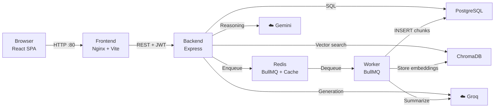
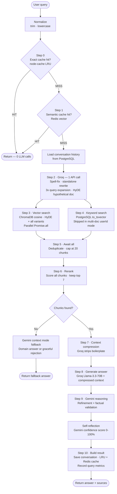
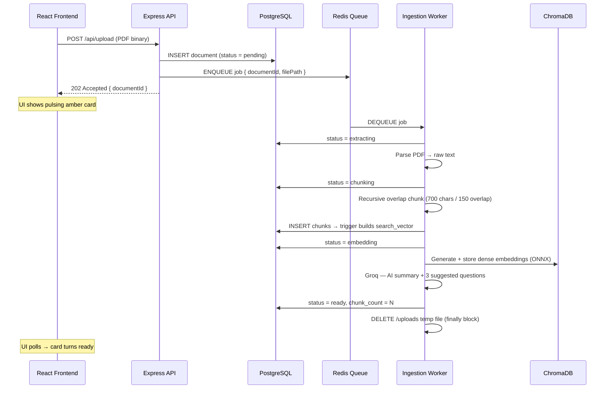
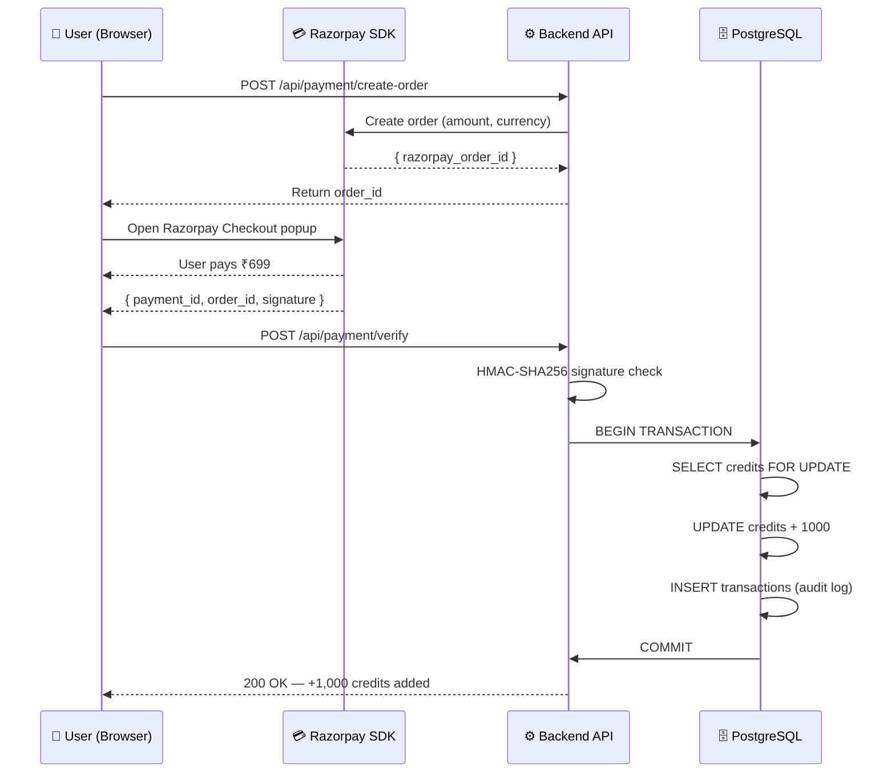
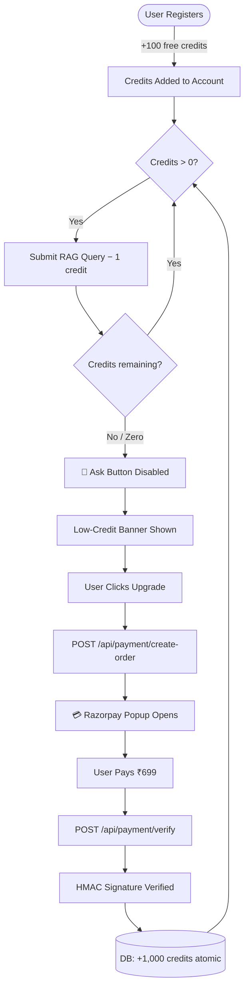
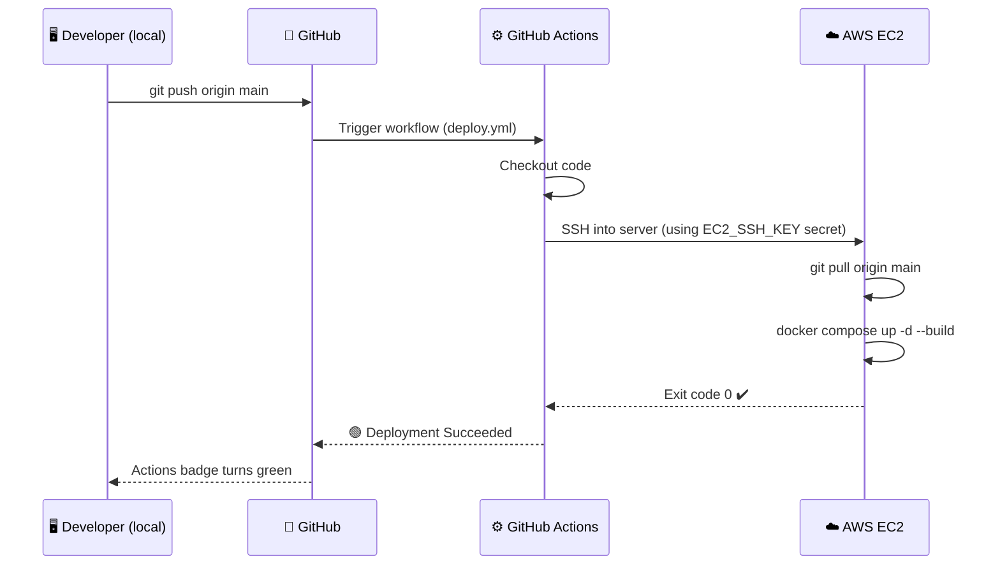
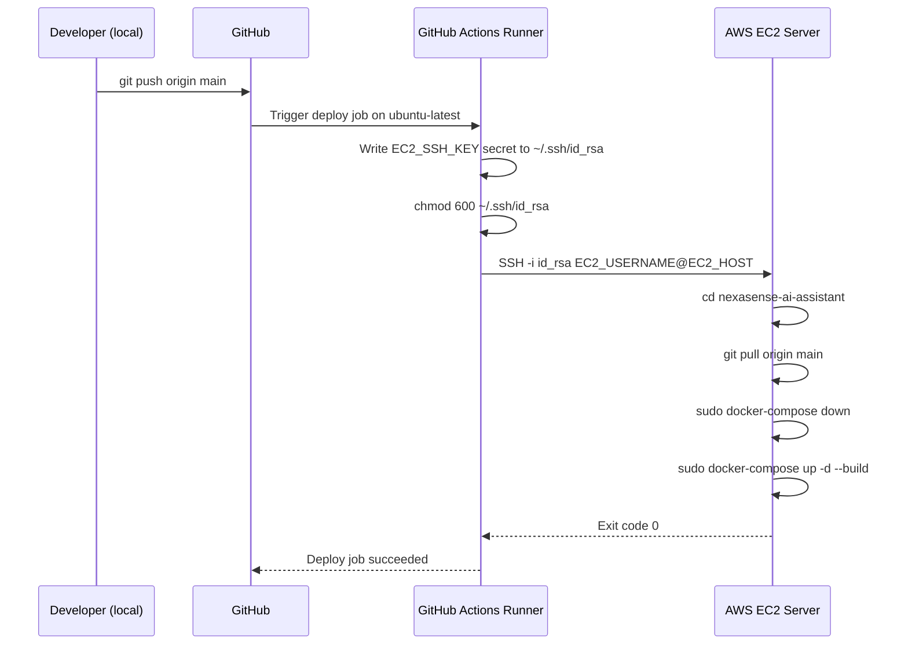

<div align="center">


[](https://github.com/rajakumar123-commit/nexasense-ai-assistant/actions)

<br/>

[](https://rajakumar-nexasense-ai.online)

<br/>

[](https://nodejs.org)
[](https://react.dev)
[](#)
[](#)
[](#)
[](#)
[](#)
[](#)
[](#-license)
[](#-contributing)

<br/>

**Upload a PDF. Ask anything. Get precise, source-backed answers in seconds.**

NexaSense is a production-deployed, fully monetized SaaS platform built on a  
**15-step RAG pipeline** with dual-LLM orchestration, hybrid vector + full-text search,  
Razorpay credit billing, and a complete microservices deployment on AWS EC2.

<br/>

[**🌐 Try It Live →**](https://rajakumar-nexasense-ai.online)&nbsp;&nbsp;·&nbsp;&nbsp;[Report Bug](https://github.com/rajakumar123-commit/nexasense-ai-assistant/issues)&nbsp;&nbsp;·&nbsp;&nbsp;[Request Feature](https://github.com/rajakumar123-commit/nexasense-ai-assistant/issues)

</div>

---

<!--
  SCREENSHOT PLACEHOLDER
  Capture: Dashboard page showing the 3D pipeline animation + metrics bar.
  Save as: assets/screenshot.png
  Then replace this comment block with:
  <div align="center">
    
  </div>
-->

---

> ### ⚡ Run locally in 60 seconds
>
> ```bash
> git clone https://github.com/rajakumar123-commit/nexasense-ai-assistant.git
> cd nexasense-ai-assistant
> cp .env.example .env   # Fill in GEMINI_API_KEY · GROQ_API_KEY · RAZORPAY keys · JWT_SECRET
> docker-compose up --build -d
> ```
>
> Open **http://localhost:5175** — register, upload a PDF, start chatting.
>
> **Prerequisites:** Docker · Docker Compose · Gemini API Key · Groq API Key · Razorpay Keys

---

## 📋 Table of Contents

| # | Section |
|---|---------|
| 1 | [Project Overview](#1--project-overview) |
| 2 | [Live Deployment](#2--live-deployment) |
| 3 | [Tech Stack](#3--tech-stack) |
| 4 | [System Architecture](#4--system-architecture) |
| 5 | [RAG Pipeline](#5--rag-pipeline) |
| 6 | [Document Ingestion Pipeline](#6--document-ingestion-pipeline) |
| 7 | [Feature Reference](#7--feature-reference) |
| 8 | [Frontend Pages & Components](#8--frontend-pages--components) |
| 9 | [API Reference](#9--api-reference) |
| 10 | [Security & Middleware](#10--security--middleware) |
| 11 | [Credit & Payment System](#11--credit--payment-system) |
| 12 | [Database Schema](#12--database-schema) |
| 13 | [RBAC Permission Matrix](#13--rbac-permission-matrix) |
| 14 | [Caching Architecture](#14--caching-architecture) |
| 15 | [React State & Hooks](#15--react-state--hooks) |
| 16 | [Project Structure](#16--project-structure) |
| 17 | [Local Setup](#17--local-setup) |
| 18 | [Production Deployment (AWS EC2)](#18--production-deployment-aws-ec2) |
| 19 | [Roadmap](#19--roadmap) |
| 20 | [Contributing](#20--contributing) |
| 21 | [Acknowledgements](#21--acknowledgements) |
| 22 | [License](#22--license) |

---

## 1. 📌 Project Overview

NexaSense is a full-stack **AI Document Intelligence** platform. Users register, upload PDFs, and chat with them in natural language. The system returns precise, source-attributed answers using a 15-step RAG pipeline — not a single `chat/completions` call.

**How it differs from a weekend chatPDF project:**

| Typical demo | NexaSense |
|---|---|
| Single LLM call | Dual-LLM: Groq (Llama 3.3-70B) for speed + Gemini 1.5 Pro for reasoning |
| No caching | 2-layer cache — in-process LRU (node-cache) + Redis semantic vector cache |
| Vector search only | Hybrid: ChromaDB cosine similarity **+** PostgreSQL `to_tsvector` full-text |
| No monetization | Razorpay credit billing, atomic `FOR UPDATE` DB transactions |
| Localhost only | AWS EC2 t3.micro, Docker Compose, custom domain via Hostinger |
| No auth | JWT access tokens + HTTP-only refresh cookies + RBAC |
| Blocking ingestion | BullMQ async worker, exponential backoff retry, idempotent job guard |

[↑ Back to Top](#-table-of-contents)

---

## 2. 🌐 Live Deployment

| | URL |
|---|---|
| **Production** | [https://rajakumar-nexasense-ai.online](https://rajakumar-nexasense-ai.online) |
| **API** | `https://rajakumar-nexasense-ai.online/api` |
| **Health check** | `https://rajakumar-nexasense-ai.online/api/health` |

[↑ Back to Top](#-table-of-contents)

---

## 3. 🛠️ Tech Stack

| Layer | Technology |
|---|---|
| Frontend | React 18, Vite, Tailwind CSS, Three.js |
| Backend | Node.js, Express.js |
| Background worker | Node.js, BullMQ |
| LLM — generation | Meta Llama 3.3-70B via Groq API |
| LLM — reasoning | Google Gemini 1.5 Pro / Flash |
| Relational DB | PostgreSQL 15 |
| Vector DB | ChromaDB v3 |
| Cache & queue broker | Redis 7 |
| Payments | Razorpay |
| Containers | Docker, Docker Compose (6 services) |
| Cloud | AWS EC2 Ubuntu 22.04, t3.micro |
| Domain | Hostinger `.online` TLD |
| CI/CD | GitHub Actions (Auto-deploy on push) |
| Email | Nodemailer + Gmail SMTP |

[↑ Back to Top](#-table-of-contents)

---

## 4. 🏗️ System Architecture

Six isolated Docker containers share one internal network. The backend never blocks on ingestion — all PDF processing is offloaded to the worker via the Redis queue.

```
┌──────────────────────────────────────────────────────────────┐
│                        Docker Network                        │
│                                                              │
│  ┌─────────────┐   REST/JWT   ┌─────────────┐               │
│  │  Frontend   │ ────────────▶│   Backend   │               │
│  │  Nginx :80  │              │ Express:3000│               │
│  └─────────────┘              └──────┬──────┘               │
│                                      │  enqueue / query      │
│                               ┌──────▼──────┐               │
│                               │    Redis     │               │
│                               │ BullMQ+Cache │               │
│                               └──────┬──────┘               │
│                                      │  dequeue              │
│                 SQL ┌────────────────▼──────────────┐ SQL   │
│           ┌─────────┤          Worker               ├──────┐│
│           ▼         │        BullMQ/Node            │      ▼│
│  ┌──────────────┐   └───────────────────────────────┘  ┌───────────┐
│  │  PostgreSQL  │      embed / store vectors           │  ChromaDB │
│  │  SQL + FTS   │ ◀────────────────────────────────── ▶│  Vectors  │
│  └──────────────┘                                       └───────────┘
│                                                              │
│           ☁️ Gemini API (reasoning)   ☁️ Groq API (speed)  │
└──────────────────────────────────────────────────────────────┘
```



[↑ Back to Top](#-table-of-contents)

---

## 5. 🧠 RAG Pipeline

Every query runs through `retrieval.pipeline.js`. **Groq (Llama 3.3-70B)** is used for speed; **Gemini 1.5 Pro** for reasoning. A cache hit short-circuits everything downstream.




[↑ Back to Top](#-table-of-contents)

---

## 6. 📁 Document Ingestion Pipeline

`POST /api/upload` responds with `202 Accepted` immediately. All heavy work runs in `ingestion.worker.js` via BullMQ so the API stays fast regardless of document size.



**Key engineering decisions:**

| Decision | Reason |
|---|---|
| `concurrency: 1` | ONNX embedding runtime is single-threaded WASM — parallel jobs crash the process |
| Skip-if-ready guard | If a job is retried after BullMQ restart and the doc is already `ready`, it exits immediately — idempotent by design |
| ONNX error suppression | Non-fatal background thread noise caught at process level; swallowed so they don't fail valid jobs |
| `finally` block cleanup | Temp PDF deleted from disk whether ingestion succeeds or fails |

[↑ Back to Top](#-table-of-contents)

---

## 7. ✨ Feature Reference

<details open>
<summary><strong>🧠 AI & RAG</strong></summary>
<br/>

| Feature | Detail |
|---|---|
| **15-Step RAG Pipeline** | Normalize → dual-cache → HyDE → hybrid search → rerank → compress → generate → reflect |
| **HyDE** | Groq writes a hypothetical answer before retrieval, dramatically sharpening the embedding query |
| **Hybrid Search** | ChromaDB (cosine) + PostgreSQL `to_tsvector` results merged for maximum recall |
| **Semantic Reranking** | All retrieved chunks re-scored against the query; only top-7 forwarded to the LLM |
| **Gemini Self-Reflection** | After generating, Gemini scores its own confidence (0–100%) and validates against source context |
| **Out-of-Domain Rejection** | Gemini domain classifier rejects off-topic queries rather than hallucinating |
| **Multi-Document Mode** | Query across every document a user owns via userId-scoped vector search |
| **Conversational Memory** | Full turn history stored in PostgreSQL; Groq rewrites each new query with prior context |

</details>

<details>
<summary><strong>📁 Document Management</strong></summary>
<br/>

| Feature | Detail |
|---|---|
| **Async Ingestion** | BullMQ worker — extract, chunk, embed, summarize — fully decoupled from the API |
| **Live Status** | `pending → extracting → chunking → embedding → ready` — UI updates reactively |
| **AI Summary** | Groq auto-generates a document summary after ingestion completes |
| **Suggested Questions** | Groq generates 3 starter questions so users can chat immediately |
| **Auto-Retry** | Exponential backoff on job failure (network error, OOM) |

</details>

<details>
<summary><strong>💳 Monetization</strong></summary>
<br/>

| Feature | Detail |
|---|---|
| **Free Credits** | 100 credits granted automatically on registration |
| **Per-Query Billing** | 1 credit deducted per RAG query |
| **Razorpay Checkout** | In-app modal — 1,000 credits for ₹699; order always created server-side |
| **Atomic Credit Update** | `SELECT … FOR UPDATE` inside a transaction prevents double-crediting race conditions |
| **Zero-Credit Guard** | "Ask" button disabled at 0; prominent upgrade card replaces the input |
| **Welcome Emails** | Automatic branded HTML email sent to new users via Nodemailer |

</details>

<details>
<summary><strong>🔐 Security</strong></summary>
<br/>

| Feature | Detail |
|---|---|
| **JWT Auth** | Short-lived access token + HTTP-only refresh cookie |
| **RBAC** | `USER` / `ADMIN` roles; guards enforced per route |
| **bcrypt** | Salted password hashing |
| **Rate Limiting** | `express-rate-limit` on all endpoints |
| **Ownership enforcement** | `permissionMiddleware.js` verifies document belongs to the requesting user |

</details>

<details>
<summary><strong>🖥️ Frontend UX</strong></summary>
<br/>

| Feature | Detail |
|---|---|
| **3D Pipeline Animation** | Three.js WebGL canvas on the Dashboard visualising all 15 RAG stages as live nodes |
| **Pipeline Inspector** | Expandable chat sidebar showing rewritten query, raw vector results, reranked chunks |
| **SSE Streaming** | Word-by-word answer delivery via Server-Sent Events |
| **Document Card States** | Amber pulse animation while processing; ring-glow on hover when ready |
| **Global Error Boundary** | Class-based `ErrorBoundary` catches any render failure — no white-screen crashes |
| **Low-Credit Banner** | Sticky warning banner appears below a configurable credit threshold |

</details>

[↑ Back to Top](#-table-of-contents)

---

## 8. 🖥️ Frontend Pages & Components

**Pages** (`/frontend/src/pages/`)

| Page | Route | What it does |
|---|---|---|
| `Login.jsx` | `/login` | Animated JWT sign-in with "Remember me" |
| `Signup.jsx` | `/signup` | Registration — auto-seeds admin on first run, grants 100 credits |
| `Dashboard.jsx` | `/dashboard` | Metrics overview (docs, chunks, queries, cache rate, avg latency, credits) + 3D pipeline animation |
| `Workspace.jsx` | `/workspace` | Drag-and-drop upload, live status cards, delete with confirm modal |
| `Chat.jsx` | `/chat/:docId` | Streaming chat, Pipeline Inspector panel, source cards, conversation history sidebar |
| `AdminPanel.jsx` | `/admin` | Platform-wide user list, credit balances, usage metrics |

**Components** (`/frontend/src/components/`)

| Component | Purpose |
|---|---|
| `Pipeline3DAnimation.jsx` | Three.js animated node graph of all 15 RAG stages |
| `PipelineInspector.jsx` | Expandable panel — rewritten query, vector/keyword results, reranked chunks |
| `PaymentModal.jsx` | Creates order, opens Razorpay SDK popup, verifies payment on success |
| `DocumentCard.jsx` | Status-aware card: amber pulse (processing) / ring-glow hover (ready) |
| `ChatMessage.jsx` | Markdown bubble with source citation preview and confidence badge |
| `ConfirmModal.jsx` | Glassmorphism confirmation dialog — replaces `window.confirm` |
| `ErrorBoundary.jsx` | Class-based global render-error catcher |
| `Navbar.jsx` | Animated credit counter, low-credit amber warning, zero-credit upgrade banner |
| `UploadModal.jsx` | Drag-and-drop file picker with real-time type/size validation |
| `ConversationSidebar.jsx` | Saved conversations per document |

[↑ Back to Top](#-table-of-contents)

---

## 9. 🔌 API Reference

<details>
<summary><strong>Auth — /api/auth</strong></summary>
<br/>

| Method | Endpoint | Auth | Description |
|---|---|---|---|
| `POST` | `/register` | — | Register user; grant 100 credits |
| `POST` | `/login` | — | Return JWT access token + set refresh cookie |
| `POST` | `/logout` | ✅ | Invalidate session; clear cookie |
| `POST` | `/refresh` | 🍪 cookie | Issue new access token from refresh cookie |
| `GET` | `/me` | ✅ | Current user profile + credit balance |

</details>

<details>
<summary><strong>Documents — /api/documents</strong></summary>
<br/>

| Method | Endpoint | Auth | Description |
|---|---|---|---|
| `GET` | `/` | ✅ | List all user documents |
| `GET` | `/:id` | ✅ | Single document metadata |
| `DELETE` | `/:id` | ✅ | Delete document + ChromaDB vectors |
| `GET` | `/:id/summary` | ✅ | AI-generated summary |
| `GET` | `/:id/suggestions` | ✅ | AI-generated starter questions |

</details>

<details>
<summary><strong>Upload · Query · Stream · Dashboard · Payment · Conversations · Admin</strong></summary>
<br/>

**Upload**

| Method | Endpoint | Auth | Description |
|---|---|---|---|
| `POST` | `/api/upload` | ✅ | Upload PDF; enqueue BullMQ job; return `documentId` |

**Query & Stream**

| Method | Endpoint | Auth | Description |
|---|---|---|---|
| `POST` | `/api/query` | ✅ | Run full 15-step RAG pipeline; deduct 1 credit |
| `POST` | `/api/stream` | ✅ | SSE streaming variant of `/api/query` |

**Dashboard — `/api/dashboard`**

| Method | Endpoint | Description |
|---|---|---|
| `GET` | `/stats` | Total docs, chunks, queries, cache rate, avg response time, remaining credits |
| `GET` | `/documents` | Per-document chunk analytics |
| `GET` | `/queries` | 50 most recent query performance records |

**Payment — `/api/payment`**

| Method | Endpoint | Description |
|---|---|---|
| `POST` | `/create-order` | Create Razorpay order server-side |
| `POST` | `/verify` | Verify HMAC-SHA256 signature; atomically credit user |

**Conversations — `/api/conversations`**

| Method | Endpoint | Description |
|---|---|---|
| `GET` | `/:docId` | List conversations for a document |
| `POST` | `/` | Create new conversation |
| `GET` | `/:id/messages` | Full message history for a conversation |

**Admin — `/api/admin`**

| Method | Endpoint | Auth | Description |
|---|---|---|---|
| `GET` | `/users` | ✅ Admin | All platform users + credit balances |

</details>

[↑ Back to Top](#-table-of-contents)

---

## 10. 🔐 Security & Middleware

| Middleware | File | Role |
|---|---|---|
| Auth Guard | `auth.middleware.js` | Validates JWT on every protected route |
| Admin Guard | `admin.middleware.js` | Rejects non-admin requests from admin-scoped routes |
| Permission Guard | `permissionMiddleware.js` | Verifies document ownership before data access |
| Rate Limiter | `rateLimit.middleware.js` | Blocks abuse via `express-rate-limit` |
| Upload Handler | `upload.middleware.js` | Multer — PDF-only, enforced size limit |
| Validation | `validation.middleware.js` | Request schema validation via `express-validator` |

**Payment verification chain:**



[↑ Back to Top](#-table-of-contents)

---

## 11. 💳 Credit & Payment System



| Plan ID | Credits | Price |
|---|---|---|
| `credits_1000` | 1,000 | ₹699 |

[↑ Back to Top](#-table-of-contents)

---

## 12. 🗄️ Database Schema

| Table | Key columns | Purpose |
|---|---|---|
| `users` | `id, email, password_hash, role, credits, created_at` | Identity + credit ledger |
| `documents` | `id, user_id, file_name, status, chunk_count, summary, error_msg` | Document state machine |
| `chunks` | `id, document_id, content, chunk_index, search_vector` | Text chunks + FTS vector (auto-populated by trigger) |
| `conversations` | `id, user_id, document_id, title, created_at` | Conversation containers |
| `messages` | `id, conversation_id, role, content, created_at` | Individual chat turns |
| `transactions` | `id, user_id, razorpay_order_id, razorpay_payment_id, credits_bought, status` | Immutable payment audit log |
| `query_metrics` | `id, user_id, document_id, total_ms, from_cache, created_at` | Per-query performance telemetry |

> **`search_vector` trigger:** PostgreSQL automatically runs `to_tsvector('english', content)` on every `INSERT` into `chunks`, populating the `search_vector` column. Full-text search requires zero application-level ETL.

[↑ Back to Top](#-table-of-contents)

---

## 13. 🔑 RBAC Permission Matrix

`seedAdmin.js` runs on every container start and idempotently provisions roles, permissions, and the admin account — safe to run on every restart.

| Permission | Admin | User | Scope |
|---|---|---|---|
| `admin:access` | ✅ | ❌ | Admin Panel + user management endpoints |
| `doc:upload` | ✅ | ✅ | Upload PDFs |
| `doc:delete` | ✅ | ❌ | Delete any document |
| `chat:query` | ✅ | ✅ | Submit RAG queries (costs 1 credit) |
| `chat:delete` | ✅ | ✅ | Delete own conversations |

**Docker Secrets support:** Set `ADMIN_EMAIL_FILE` / `ADMIN_PASSWORD_FILE` to inject credentials from Docker Secrets files rather than plain-text `.env`.

**Credential rotation:** `ADMIN_FORCE_RESET=true` in `.env` rotates the admin password to the new value on next startup.

[↑ Back to Top](#-table-of-contents)

---

## 14. ⚡ Caching Architecture

NexaSense runs two independent cache layers. Either layer can serve a response without touching an LLM.

| Layer | Technology | TTL | Key | Capacity |
|---|---|---|---|---|
| **Exact match** | `node-cache` in-process LRU | 5 min | `{docId}:{first 80 chars of query}` | 5,000 keys |
| **Semantic** | Redis vector cosine similarity | Configurable | Conceptual match, cross-document | Unlimited |

- Only successful responses are cached — errors are never stored.
- Calling `invalidateDocument(docId)` purges all exact-match entries for that document instantly.
- Stats (`hits`, `misses`, `stores`, `hitRate%`) are tracked at runtime and surfaced on the Dashboard.

[↑ Back to Top](#-table-of-contents)

---

## 15. ⚛️ React State & Hooks

**Global contexts** (`/frontend/src/context/`)

| Context | Provides |
|---|---|
| `AuthContext` | Authenticated user object + JWT token; `login()` / `logout()` |
| `CreditsContext` | Live credit balance; `deductCredit()` called after every successful query |

**Custom hooks** (`/frontend/src/hooks/`)

| Hook | Purpose |
|---|---|
| `useApi` | Axios instance with auto-injected `Authorization` header + response normalization |
| `useCredits` | Reads balance from `CreditsContext`; blocks form submission when credits = 0 |
| `useStream` | Opens and manages an SSE connection; streams tokens into chat state |
| `useTheme` | Persists dark/light preference in `localStorage` |

**Route protection** — `ProtectedLayout.jsx` wraps all authenticated routes. Unauthenticated requests are redirected to `/login` via `AuthContext`.

[↑ Back to Top](#-table-of-contents)

---

## 16. 📂 Project Structure

<details>
<summary><strong>Expand full tree</strong></summary>
<br/>

```
nexasense-ai-assistant/
│
├── src/                          # Backend
│   ├── cache/                    # Exact-match LRU + Redis semantic cache
│   ├── config/                   # PostgreSQL, Redis, ChromaDB, Razorpay clients
│   ├── controllers/              # Auth · Document · Upload · Query · Payment · Dashboard · Admin
│   ├── db/                       # PostgreSQL connection pool
│   ├── middleware/               # Auth · Admin · Permission · RateLimit · Validation · Upload
│   ├── pipelines/
│   │   └── retrieval.pipeline.js # 15-step RAG orchestrator
│   ├── queue/                    # BullMQ queue definition
│   ├── routes/                   # 9 Express router files
│   ├── services/                 # 22 AI microservices — HyDE, Reranker, Embedder, …
│   ├── utils/                    # logger · recursiveChunk · verifySignature
│   ├── workers/
│   │   └── ingestion.worker.js   # BullMQ document processing worker
│   ├── app.js                    # Express app factory
│   └── server.js                 # HTTP server entry point
│
├── frontend/                     # React (Vite)
│   └── src/
│       ├── pages/                # Login · Signup · Dashboard · Workspace · Chat · AdminPanel
│       ├── components/           # 13 components (see §8)
│       ├── context/              # AuthContext · CreditsContext
│       ├── hooks/                # useApi · useCredits · useStream · useTheme
│       └── services/             # Axios API clients
│
├── schema.sql                    # Full PostgreSQL schema + FTS triggers
├── docker-compose.yml            # 6-service orchestration
├── Dockerfile                    # Backend + Worker image
├── .env.example                  # All required environment variables
└── README.md
```

</details>

[↑ Back to Top](#-table-of-contents)

---

## 17. 🖥️ Local Setup

**Prerequisites:** Docker, Docker Compose, Gemini API key, Groq API key, Razorpay key pair.

```bash
git clone https://github.com/rajakumar123-commit/nexasense-ai-assistant.git
cd nexasense-ai-assistant
cp .env.example .env
# Edit .env — fill in all required keys
docker-compose up --build -d
docker-compose ps               # All 6 services should show "Up"
docker-compose logs -f backend  # Watch startup + seed logs
```

| Service | URL |
|---|---|
| Frontend | http://localhost:5175 |
| Backend API | http://localhost:3000 |
| ChromaDB | http://localhost:8000 |
| Redis | redis://localhost:6379 |

[↑ Back to Top](#-table-of-contents)

---

## 18. ☁️ Production Deployment (AWS EC2)

**Instance:** t3.micro, Ubuntu 22.04. The 4 GB swapfile is non-negotiable — the ONNX embedding model exceeds the 1 GB physical RAM without it.

```bash
# 1. SSH in
ssh -i nexasense-key.pem ubuntu@<EC2-PUBLIC-IP>

# 2. Swapfile (required)
sudo fallocate -l 4G /swapfile
sudo chmod 600 /swapfile && sudo mkswap /swapfile && sudo swapon /swapfile

# 3. Docker
sudo apt update && sudo apt install -y docker.io docker-compose
sudo systemctl enable docker
```bash
# On your server (first time setup)
git clone https://github.com/rajakumar123-commit/nexasense-ai-assistant.git
cd nexasense-ai-assistant
nano .env  # production values
sudo docker compose up -d
```

**CI/CD Auto-Deploy Workflow:**



**DNS records (Hostinger):**

| Type | Host | Value | TTL |
|---|---|---|---|
| `A` | `@` | `16.171.19.129` | 300 |
| `CNAME` | `www` | `rajakumar-nexasense-ai.online` | 300 |

**CI/CD Auto-Deploy Workflow (`deploy.yml`):**



For a manual redeploy:

```bash
cd ~/nexasense-ai-assistant
git pull origin main
sudo docker-compose up -d --build
```

[↑ Back to Top](#-table-of-contents)

---

## 19. 🗺️ Roadmap

**Completed ✅**

- [x] JWT auth + RBAC + PostgreSQL schema + Redis
- [x] 15-step RAG pipeline with dual-LLM orchestration
- [x] BullMQ async ingestion worker with retry/backoff
- [x] Razorpay credit billing with atomic DB transactions
- [x] Three.js 3D pipeline animation + Pipeline Inspector + SSE streaming
- [x] AWS EC2 + Docker Compose deployment + Hostinger DNS
- [x] LangChain persistent cross-session conversational memory
- [x] **New**: GitHub Actions CI/CD Pipeline (Auto-deploy on every push)
- [x] **New**: Automatic Welcome Email Notifications (Nodemailer + Gmail SMTP)
- [x] **New**: HTTPS via Caddy reverse proxy (auto-SSL)
- [x] **New**: Private GitHub Repository with SSH Deploy Key

**Planned 🔮**

- [ ] Multi-format ingestion — `.docx`, `.xlsx`, `.txt`, images (Tesseract OCR)
- [ ] Web-scraping RAG — paste a URL, auto-index the page
- [ ] S3 for scalable file storage (replace local `/uploads`)
- [ ] Razorpay webhook for automated billing reconciliation
- [ ] Rate limiting per API route (Redis-backed)

[↑ Back to Top](#-table-of-contents)

---

## 20. 🤝 Contributing

```bash
# 1. Fork the repository
# 2. Create a feature branch
git checkout -b feature/your-feature

# 3. Commit (Conventional Commits preferred)
git commit -m "feat: describe your change"

# 4. Push and open a Pull Request
git push origin feature/your-feature
```

- Match existing code style and naming conventions.
- Add inline comments for anything non-obvious — especially inside `retrieval.pipeline.js`.
- Verify everything works with `docker-compose up --build` before submitting.
- For significant features, open an issue first to align on design.

[↑ Back to Top](#-table-of-contents)

---

## 21. 🙏 Acknowledgements

| Project | Role in NexaSense |
|---|---|
| [Google Gemini](https://ai.google.dev/) | Reasoning, self-reflection, domain classification, answer refinement |
| [Groq + Llama 3.3](https://groq.com/) | High-speed query rewriting, HyDE, context compression, answer generation |
| [ChromaDB](https://www.trychroma.com/) | Dense vector storage and cosine similarity search |
| [BullMQ](https://bullmq.io/) | Async job queue with retry and backoff |
| [Razorpay](https://razorpay.com/) | Payment gateway and order verification |
| [Redis](https://redis.io/) | Semantic cache layer + BullMQ message broker |
| [Three.js](https://threejs.org/) | 3D pipeline visualization |
| [Vite](https://vitejs.dev/) | Frontend build tooling |

[↑ Back to Top](#-table-of-contents)

---

## 22. 📄 License

Licensed under the [MIT License](LICENSE). © 2025 Rajakumar.

---

<div align="center">

[](https://github.com/rajakumar123-commit/nexasense-ai-assistant)

<<<<<<< HEAD
*Built with ❤️ and relentless engineering by [Rajakumar](https://github.com/rajakumar123-commit)*
=======
*Built with ❤️ and 40 days of focused engineering by [Rajakumar](https://github.com/rajakumar123-commit)*
>>>>>>> 96b60b7cf98791ca575de0bc9ad8d97b1261fb43


</div>
