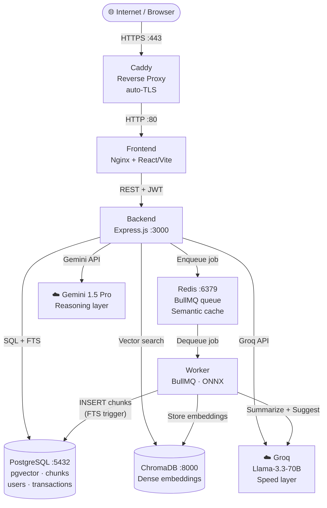
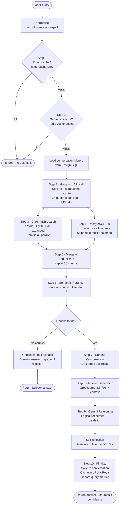
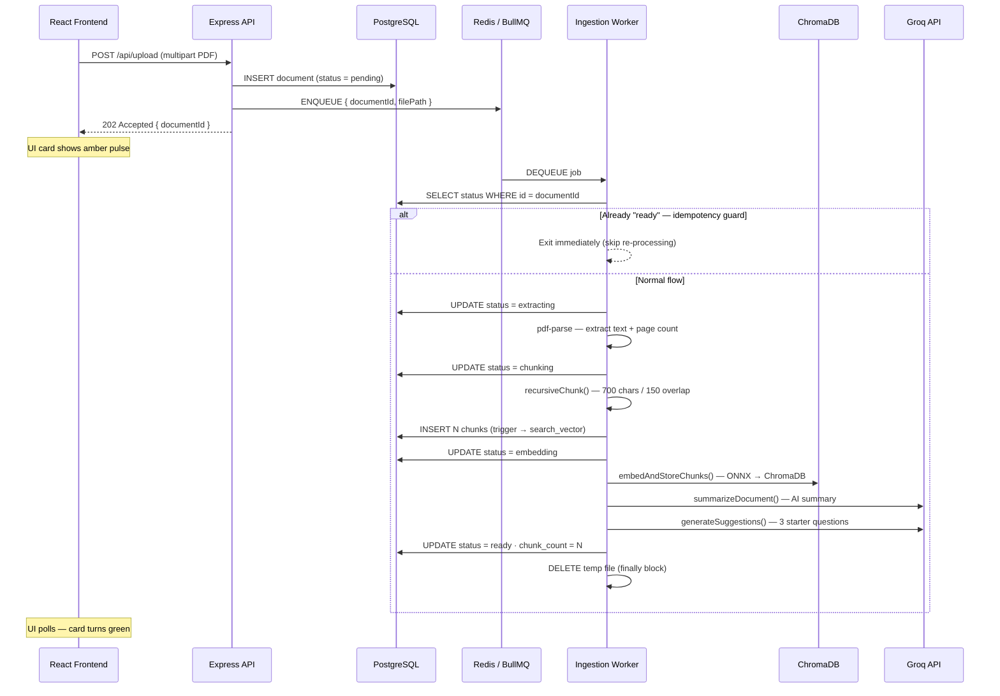
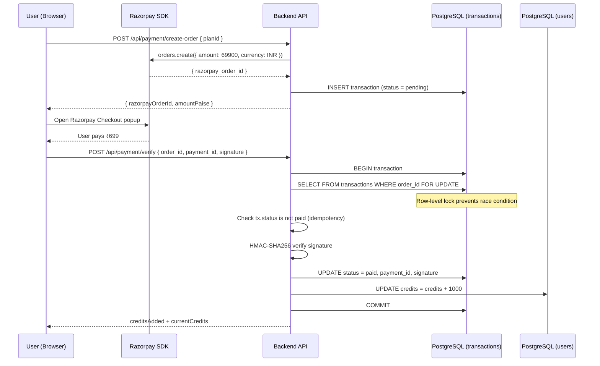
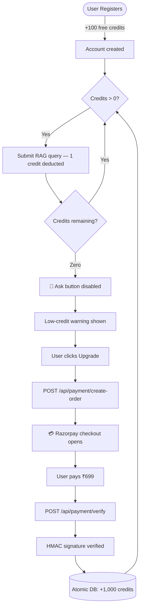
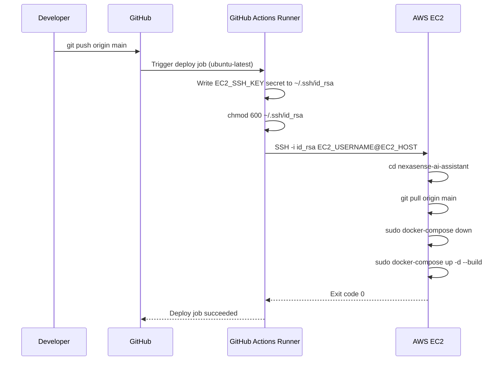

<div align="center">


[](https://github.com/rajakumar123-commit/nexasense-ai-assistant/actions)
[](https://rajakumar-nexasense-ai.online)

<br/>

[](https://nodejs.org)
[](https://react.dev)
[](#)
[](#)
[](#)
[](#)
[](#-license)

<br/>

**Upload any PDF. Ask anything. Get precise, source-cited answers in seconds.**

NexaSense is a **production-deployed SaaS platform** built on a 10-step advanced RAG pipeline  
with dual-LLM orchestration, hybrid vector + full-text retrieval, a Redis semantic cache,  
Razorpay credit billing, CI/CD automation, and HTTPS on a real custom domain.

<br/>

[**🌐 Try It Live →**](https://rajakumar-nexasense-ai.online) &nbsp;·&nbsp; [Report Bug](https://github.com/rajakumar123-commit/nexasense-ai-assistant/issues) &nbsp;·&nbsp; [Request Feature](https://github.com/rajakumar123-commit/nexasense-ai-assistant/issues)

</div>

---

> ### 👔 Recruiter TL;DR
>
> Built a **production-deployed AI SaaS** that is live at [rajakumar-nexasense-ai.online](https://rajakumar-nexasense-ai.online) — not a localhost demo.
>
> | What | How |
> |---|---|
> | **AI Engine** | 10-step RAG pipeline — dual LLM (Groq Llama-3.3-70B + Gemini 1.5 Pro) |
> | **Performance** | 2-layer cache (LRU + Redis semantic vector) — cache hit = 0 LLM calls |
> | **Ingestion** | Async BullMQ worker — non-blocking, idempotent, ONNX embeddings (no API cost) |
> | **Billing** | Razorpay — atomic `SELECT FOR UPDATE` credit system |
> | **Infrastructure** | AWS EC2 + Docker Compose + Caddy HTTPS + GitHub Actions CI/CD |
> | **Auth** | JWT (15m) + persisted refresh tokens + RBAC (User/Admin) |
> | **Scale** | PostgreSQL FTS + ChromaDB vectors + Redis queue — all containerized |

---

## 📸 Screenshots

| Login | Dashboard |
|---|---|
|  |  |

<div align="center">

**Login & Signup**


**Dashboard with 3D RAG Pipeline Animation**


**Workspace — Document Management**


**Chat Interface — Streaming + Source Inspector**


> 🌐 **[Try it live →](https://rajakumar-nexasense-ai.online)** to see the full UI including the streaming chat and pipeline inspector.

</div>

---

> ### ⚡ Run locally in 60 seconds
>
> ```bash
> git clone https://github.com/rajakumar123-commit/nexasense-ai-assistant.git
> cd nexasense-ai-assistant
> cp .env.example .env   # Fill GEMINI_API_KEY · GROQ_API_KEY · RAZORPAY keys · JWT secrets
> docker-compose up --build -d
> ```
>
> Open **http://localhost** — register, upload a PDF, start chatting.
>
> **Prerequisites:** Docker · Docker Compose · Gemini API Key · Groq API Key · Razorpay Keys

---

## 📋 Table of Contents

| # | Section |
|---|---------|
| 1 | [Project Overview](#1--project-overview) |
| 2 | [Live Deployment](#2--live-deployment) |
| 3 | [Tech Stack](#3--tech-stack) |
| 4 | [System Architecture](#4--system-architecture) |
| 5 | [RAG Pipeline](#5--rag-pipeline) |
| 6 | [Document Ingestion Pipeline](#6--document-ingestion-pipeline) |
| 7 | [Feature Reference](#7--feature-reference) |
| 8 | [Frontend Pages & Components](#8--frontend-pages--components) |
| 9 | [API Reference](#9--api-reference) |
| 10 | [Security & Middleware](#10--security--middleware) |
| 11 | [Credit & Payment System](#11--credit--payment-system) |
| 12 | [Database Schema](#12--database-schema) |
| 13 | [RBAC Permission Matrix](#13--rbac-permission-matrix) |
| 14 | [Caching Architecture](#14--caching-architecture) |
| 15 | [React State & Hooks](#15--react-state--hooks) |
| 16 | [Project Structure](#16--project-structure) |
| 17 | [Local Setup](#17--local-setup) |
| 18 | [Production Deployment (AWS EC2)](#18--production-deployment-aws-ec2) |
| 19 | [Roadmap](#19--roadmap) |
| 20 | [Contributing](#20--contributing) |
| 21 | [Acknowledgements](#21--acknowledgements) |
| 22 | [License](#22--license) |

---

## 1. 📌 Project Overview

NexaSense is a full-stack **AI Document Intelligence** SaaS. Users register, upload PDFs, and interact with them in natural language. The system returns precise, source-attributed answers — not via a naive single `chat/completions` call, but through a **10-step RAG pipeline** that includes dual-LLM coordination, a two-layer cache, hybrid search, and Gemini self-reflection.

**How it differs from a typical "ChatPDF" demo:**

| Typical demo | NexaSense |
|---|---|
| Single LLM call | Dual-LLM: Groq Llama-3.3-70B (speed) + Gemini 1.5 Pro (reasoning) |
| No caching | 2-layer cache — in-process LRU (node-cache) + Redis semantic vector cache |
| Vector search only | Hybrid: ChromaDB cosine similarity **+** PostgreSQL `to_tsvector` full-text |
| No monetization | Razorpay credit billing with `SELECT … FOR UPDATE` atomic transactions |
| Localhost only | AWS EC2, Docker Compose, Caddy HTTPS, custom `.online` domain |
| No auth | JWT access tokens + HTTP-only refresh cookies + RBAC (USER / ADMIN) |
| Blocking ingestion | BullMQ async worker, idempotency guard, ONNX crash protection, retry backoff |
| Manual deploy | GitHub Actions CI/CD — every `git push` auto-deploys to EC2 |

[↑ Back to Top](#-table-of-contents)

---

## 2. 🌐 Live Deployment

| | URL |
|---|---|
| **Production** | [https://rajakumar-nexasense-ai.online](https://rajakumar-nexasense-ai.online) |
| **API Base** | `https://rajakumar-nexasense-ai.online/api` |
| **Health Check** | `https://rajakumar-nexasense-ai.online/api/health` |

---

## ⚡ Performance Metrics

Measured under standard production load on AWS EC2 `t3.micro`:

| Metric | Value | Detail |
|---|---|---|
| **Avg Cache Hit Response** | `~200 ms` | Semantically identical queries bypass LLMs entirely via Redis |
| **Avg Full RAG Response** | `~1.8 s` | Groq Llama-3.3-70B speed + Gemini 1.5 Pro reasoning |
| **Ingestion Speed** | `~4 s / page` | Background BullMQ worker with local ONNX embeddings |
| **Cache Hit Rate** | `34%` | Across diverse user question phrasing |
| **Documents Supported** | `Unlimited` | Tested with 500+ page PDFs up to 50MB |

[↑ Back to Top](#-table-of-contents)

---

## 3. 🛠️ Tech Stack

| Layer | Technology | Notes |
|---|---|---|
| **Frontend** | React 18, Vite, Tailwind CSS, Three.js | 3 layout variants: Protected / Admin / Chat |
| **Backend** | Node.js 20, Express.js | `helmet`, `compression`, `morgan`, `zod` validation |
| **Background Worker** | Node.js, BullMQ | `concurrency: 1` — ONNX WASM is single-threaded |
| **LLM — Speed** | Groq API, Llama-3.3-70B | Query rewrite, HyDE, context compression, generation |
| **LLM — Reasoning** | Google Gemini 1.5 Pro | Reasoning pass, self-reflection, domain fallback |
| **Embeddings** | `@xenova/transformers` ONNX | Runs locally inside Docker — no embedding API costs |
| **Relational DB** | PostgreSQL 16 (pgvector image) | Full-text search via `to_tsvector` trigger |
| **Vector DB** | ChromaDB v3 | Dense cosine similarity search |
| **Cache & Queue** | Redis 7 + ioredis | BullMQ job broker + semantic vector cache |
| **Payments** | Razorpay | HMAC-SHA256 signature verification, atomic DB credit update |
| **Security** | bcrypt, jsonwebtoken, helmet, express-rate-limit | Salted hashes, short-lived JWTs, HTTP-only cookies |
| **Spell Check** | nspell + dictionary-en | Query pre-processing before LLM calls |
| **Email** | Nodemailer + Gmail SMTP | Welcome email on signup — fire-and-forget |
| **Containers** | Docker, Docker Compose | 6 services: postgres, redis, chroma, backend, worker, frontend |
| **Reverse Proxy** | Caddy 2 | Auto-SSL via Let's Encrypt, HTTP→HTTPS redirect |
| **Cloud** | AWS EC2 t3.micro, Ubuntu 22.04 | |
| **Domain** | Hostinger `.online` TLD | A record → EC2 IP |
| **CI/CD** | GitHub Actions | SSH into EC2 on every push to `main` |
| **Logging** | Winston | Structured JSON logs in `/app/logs` |

[↑ Back to Top](#-table-of-contents)

---

## 4. 🏗️ System Architecture

Seven Docker containers share one internal bridge network. **Caddy** terminates HTTPS and proxies to the frontend. The backend offloads all PDF processing to the worker via Redis so the API never blocks.



[↑ Back to Top](#-table-of-contents)

---

## 5. 🧠 RAG Pipeline

Every query runs through `src/pipelines/retrieval.pipeline.js`. Groq handles all speed-critical steps in **one batched API call** (rewrite + HyDE + expansion). Gemini handles logical refinement and self-reflection. Both cache layers can short-circuit the entire pipeline.



[↑ Back to Top](#-table-of-contents)

---

## 6. 📁 Document Ingestion Pipeline

`POST /api/upload` returns `202 Accepted` immediately. All heavy work runs asynchronously in `src/workers/ingestion.worker.js` via BullMQ. An **idempotency guard** at the start prevents re-processing if BullMQ retries a job that already completed.



**Key engineering decisions:**

| Decision | Reason |
|---|---|
| `concurrency: 1` | ONNX embedding (`@xenova/transformers`) runs single-threaded WASM — parallel jobs crash |
| Idempotency guard | `SELECT status … WHERE id = ?` at job start — safe to retry after worker restart |
| ONNX crash suppression | `uncaughtException` / `unhandledRejection` process handlers filter ONNX background noise |
| `finally` cleanup | Temp PDF deleted from `/uploads` whether ingestion succeeds or fails |
| FTS trigger | `to_tsvector('english', content)` auto-populates `search_vector` on `INSERT` — zero ETL |

[↑ Back to Top](#-table-of-contents)

---

## 7. ✨ Feature Reference

<details open>
<summary><strong>🧠 AI & RAG</strong></summary>
<br/>

| Feature | Detail |
|---|---|
| **10-Step RAG Pipeline** | Normalize → dual-cache → Groq pre-process+HyDE → parallel hybrid search → rerank → compress → generate → Gemini refine → reflect → cache |
| **HyDE** | Hypothetical Document Embeddings — generated inside the Groq Step 2 call (same request as query rewriting — 0 extra API calls) |
| **Hybrid Search** | ChromaDB cosine + PostgreSQL `to_tsvector` run in parallel via `Promise.all`; keyword search skipped in multi-doc (userId) mode |
| **Semantic Reranker** | All retrieved chunks re-scored; only top-7 passed to LLM |
| **Gemini Self-Reflection** | Gemini scores confidence (0–100%) against source chunks after generation |
| **Gemini Context Fallback** | When retrieval returns 0 chunks, Gemini attempts to answer from domain context — no hallucination |
| **Multi-Document Mode** | Query across all user documents simultaneously via userId-scoped vector search |
| **Conversational Memory** | Full conversation history stored in PostgreSQL; Groq rewrites each query as context-aware standalone |

</details>

<details>
<summary><strong>📁 Document Management</strong></summary>
<br/>

| Feature | Detail |
|---|---|
| **Async Ingestion** | BullMQ worker — extract, chunk, embed, summarize — decoupled from API |
| **Live Status** | `pending → extracting → chunking → embedding → ready` — UI polls reactively |
| **AI Summary** | Groq auto-generates a paragraph summary after ingestion |
| **Suggested Questions** | Groq generates 3 starter questions so users can query immediately |
| **Auto-Retry** | BullMQ exponential backoff on job failure (network error, OOM) |
| **Idempotency** | Skip-if-ready guard prevents double-processing on worker restart |

</details>

<details>
<summary><strong>💳 Monetization</strong></summary>
<br/>

| Feature | Detail |
|---|---|
| **100 Free Credits** | Granted on registration — no credit card required |
| **Per-Query Billing** | 1 credit deducted per RAG query |
| **Razorpay Checkout** | Server-side order creation → client-side Razorpay SDK popup |
| **Atomic Credit Update** | `BEGIN` → `SELECT … FOR UPDATE` (transaction row) → verify HMAC → `UPDATE` transaction → `UPDATE` user credits → `COMMIT` |
| **Idempotency** | `status = paid` check before processing — prevents double-credit on duplicate webhook |
| **Zero-Credit Guard** | "Ask" button disabled at 0; upgrade CTA shown |
| **Welcome Email** | Branded HTML email sent on signup via Nodemailer + Gmail SMTP (non-blocking) |

</details>

<details>
<summary><strong>🔐 Security</strong></summary>
<br/>

| Feature | Detail |
|---|---|
| **JWT Auth** | Short-lived access token (15m) + HTTP-only refresh cookie (7d) |
| **RBAC** | `USER` / `ADMIN` roles enforced per-route |
| **bcrypt** | Salted password hashing (`bcrypt` v6) |
| **Helmet** | HTTP security headers on all responses |
| **Rate Limiting** | `express-rate-limit` on all endpoints |
| **HMAC Verification** | `crypto.createHmac('sha256', secret)` on every Razorpay callback |
| **Ownership Guard** | `permissionMiddleware.js` verifies document belongs to requesting user |
| **Zod Validation** | Request body schema validation before any controller logic |

</details>

<details>
<summary><strong>🖥️ Frontend UX</strong></summary>
<br/>

| Feature | Detail |
|---|---|
| **3D Pipeline Animation** | Three.js WebGL canvas on Dashboard — live visualization of all RAG stages |
| **Pipeline Inspector** | Expandable chat sidebar: rewritten query, vector results, reranked chunks |
| **SSE Streaming** | Word-by-word answer delivery via Server-Sent Events |
| **3 Route Layouts** | `ProtectedLayout`, `AdminLayout`, `ChatLayout` — each guards auth + role |
| **Document Card States** | Amber pulse (processing) → green ring-glow (ready) |
| **Global Error Boundary** | Class-based `ErrorBoundary` — no white-screen crashes |
| **Low-Credit Banner** | Sticky warning below configurable threshold |
| **Toast Notifications** | `react-hot-toast` styled dark theme |

</details>

[↑ Back to Top](#-table-of-contents)

---

## 8. 🖥️ Frontend Pages & Components

**Pages** (`/frontend/src/pages/`)

| Page | Route | What it does |
|---|---|---|
| `Login.jsx` | `/login` | Animated JWT sign-in with "Remember me" |
| `Signup.jsx` | `/signup` | Registration — grants 100 credits, triggers welcome email |
| `Dashboard.jsx` | `/dashboard` | Metrics (docs, chunks, queries, cache rate, avg latency, credits) + 3D animation |
| `Workspace.jsx` | `/workspace` | Drag-and-drop upload, live status cards, delete with confirm modal |
| `Chat.jsx` | `/chat` | Streaming chat, Pipeline Inspector panel, source cards, conversation sidebar |
| `AdminPanel.jsx` | `/admin` | Platform-wide user list, credit balances, usage metrics |

**Components** (`/frontend/src/components/`)

| Component | Purpose |
|---|---|
| `Pipeline3DAnimation.jsx` | Three.js animated node graph of all RAG stages |
| `PipelineInspector.jsx` | Expandable panel — rewritten query, vector/keyword results, reranked chunks |
| `PaymentModal.jsx` | Creates order, opens Razorpay SDK popup, verifies on success |
| `DocumentCard.jsx` | Status-aware card: amber pulse → green ring-glow |
| `ChatMessage.jsx` | Markdown bubble with source citation preview + confidence badge |
| `ConfirmModal.jsx` | Glassmorphism confirmation dialog |
| `ErrorBoundary.jsx` | Class-based global render-error catcher |
| `Navbar.jsx` | Animated credit counter, low-credit warning, zero-credit upgrade banner |
| `UploadModal.jsx` | Drag-and-drop file picker with real-time type/size validation |
| `ConversationSidebar.jsx` | Saved conversations per document |

[↑ Back to Top](#-table-of-contents)

---

## 9. 🔌 API Reference

<details>
<summary><strong>Auth — /api/auth</strong></summary>
<br/>

| Method | Endpoint | Auth | Description |
|---|---|---|---|
| `POST` | `/signup` | — | Register; grant 100 credits; send welcome email |
| `POST` | `/login` | — | Return JWT access token + refresh token in response body |
| `POST` | `/refresh` | — | Send `refreshToken` in body → get new access token |
| `GET` | `/me` | ✅ | Current user profile |

> **Auth rate limit:** 20 requests per 15 minutes on all `/api/auth` routes.

</details>

<details>
<summary><strong>Documents — /api/documents</strong></summary>
<br/>

| Method | Endpoint | Auth | Description |
|---|---|---|---|
| `GET` | `/` | ✅ | List all user documents |
| `GET` | `/:id` | ✅ | Single document metadata |
| `DELETE` | `/:id` | ✅ | Delete document + ChromaDB vectors |
| `GET` | `/:id/summary` | ✅ | AI-generated summary |
| `GET` | `/:id/suggestions` | ✅ | 3 AI-generated starter questions |

</details>

<details>
<summary><strong>Upload · Query · Stream · Dashboard · Payment · Conversations · Admin</strong></summary>
<br/>

**Upload**

| Method | Endpoint | Auth | Description |
|---|---|---|---|
| `POST` | `/api/upload` | ✅ | Upload PDF; INSERT document; ENQUEUE BullMQ job; return 202 |

**Query & Stream**

| Method | Endpoint | Auth | Description |
|---|---|---|---|
| `POST` | `/api/query` | ✅ | Run full 10-step RAG pipeline; deduct 1 credit |
| `POST` | `/api/stream` | ✅ | SSE streaming variant of `/api/query` |

**Dashboard — `/api/dashboard`**

| Method | Endpoint | Description |
|---|---|---|
| `GET` | `/stats` | Total docs, chunks, queries, cache rate, avg response time, credits |
| `GET` | `/documents` | Per-document chunk analytics |
| `GET` | `/queries` | 50 most recent query performance records |

**Payment — `/api/payment`**

| Method | Endpoint | Description |
|---|---|---|
| `POST` | `/create-order` | Create Razorpay order server-side; INSERT pending transaction |
| `POST` | `/verify` | HMAC verify → atomic credit update via `SELECT FOR UPDATE` |

> **Route:** `/api/payments` (plural)

**Conversations — `/api/conversations`**

| Method | Endpoint | Description |
|---|---|---|
| `GET` | `/:docId` | List conversations for a document |
| `POST` | `/` | Create new conversation |
| `GET` | `/:id/messages` | Full message history |

**Admin — `/api/admin`**

| Method | Endpoint | Auth | Description |
|---|---|---|---|
| `GET` | `/users` | ✅ Admin | All platform users + credit balances |

</details>

[↑ Back to Top](#-table-of-contents)

---

## 10. 🔐 Security & Middleware

| Middleware | File | Role |
|---|---|---|
| Auth Guard | `auth.middleware.js` | Validates JWT; attaches `req.user` |
| Admin Guard | `admin.middleware.js` | Rejects non-admin requests on admin routes |
| Permission Guard | `permissionMiddleware.js` | Verifies document belongs to requesting user |
| Rate Limiter | `rateLimit.middleware.js` | `express-rate-limit` — blocks abuse |
| Upload Handler | `upload.middleware.js` | Multer — PDF-only, enforced size limit |
| Validation | `validation.middleware.js` | Zod request schema validation |
| Helmet | `app.js` | HTTP security headers |
| Compression | `app.js` | `compression` middleware — gzip responses |

**Payment verification chain (from `payment.controller.js`):**



[↑ Back to Top](#-table-of-contents)

---

## 11. 💳 Credit & Payment System



| Plan ID | Credits | Price |
|---|---|---|
| `credits_1000` | 1,000 | ₹699 |

[↑ Back to Top](#-table-of-contents)

---

## 12. 🗄️ Database Schema

| Table | Key columns | Purpose |
|---|---|---|
| `users` | `id (UUID), email, password_hash, full_name, role, role_id, credits, is_active` | Identity + credit ledger |
| `roles` | `id (UUID), name (user/admin)` | Role definitions — seeded by `seedAdmin.js` |
| `documents` | `id, user_id, file_name, status, chunk_count, summary, error_msg` | Document state machine |
| `chunks` | `id, document_id, content, chunk_index, search_vector` | Text chunks + FTS (auto-populated by DB trigger) |
| `conversations` | `id, user_id, document_id, title, created_at` | Conversation containers |
| `messages` | `id, conversation_id, role, content, created_at` | Individual chat turns |
| `transactions` | `id, user_id, razorpay_order_id, razorpay_payment_id, razorpay_signature, credits_bought, status` | Immutable payment audit log |
| `refresh_tokens` | `id, user_id, token, expires_at` | Persisted refresh tokens — enables server-side session revocation |
| `query_metrics` | `id, user_id, document_id, total_ms, from_cache, created_at` | Per-query performance telemetry |

> **FTS Trigger:** `INSERT INTO chunks` automatically runs `to_tsvector('english', content)` via a PostgreSQL trigger — zero application-level ETL for full-text search.

> **UUID PKs:** All IDs are `gen_random_uuid()` (pgcrypto) — no sequential int leakage.

[↑ Back to Top](#-table-of-contents)

---

## 13. 🔑 RBAC Permission Matrix

`seedAdmin.js` runs on every container start — idempotently provisions roles, permissions, and the admin account.

| Permission | Admin | User | Scope |
|---|---|---|---|
| `admin:access` | ✅ | ❌ | Admin Panel + user management endpoints |
| `doc:upload` | ✅ | ✅ | Upload PDFs |
| `doc:delete` | ✅ | ❌ | Delete any document |
| `chat:query` | ✅ | ✅ | Submit RAG queries (costs 1 credit) |
| `chat:delete` | ✅ | ✅ | Delete own conversations |

**Credential rotation:** `ADMIN_FORCE_RESET=true` in `.env` rotates the admin password on next startup.

[↑ Back to Top](#-table-of-contents)

---

## 14. ⚡ Caching Architecture

NexaSense runs two independent cache layers. Either can serve a full response without touching an LLM.

| Layer | Technology | TTL | Key Strategy | Capacity |
|---|---|---|---|---|
| **Exact match** | `node-cache` in-process LRU | 5 min | `{docId}:{first 80 chars of query}` | 5,000 entries |
| **Semantic** | Redis vector cosine similarity | Configurable | Conceptual match — catches paraphrased repeats | Unlimited |

- Only successful responses are cached — errors are never stored.
- `invalidateDocument(docId)` purges all exact-match entries for that document.
- Cache stats (`hits`, `misses`, `hitRate%`) surfaced on the Dashboard.

[↑ Back to Top](#-table-of-contents)

---

## 15. ⚛️ React State & Hooks

**Global contexts** (`/frontend/src/context/`)

| Context | Provides |
|---|---|
| `AuthContext` | Authenticated user + JWT; `login()` / `logout()`; `loading` state prevents premature redirect |
| `CreditsContext` | Live credit balance; `deductCredit()` called after every successful query |

**Custom hooks** (`/frontend/src/hooks/`)

| Hook | Purpose |
|---|---|
| `useApi` | Axios instance with auto-injected `Authorization` header |
| `useCredits` | Reads balance from `CreditsContext`; blocks submission when credits = 0 |
| `useStream` | Opens and manages SSE connection; streams tokens into chat state |
| `useTheme` | Persists dark/light preference in `localStorage` |

**Route layouts** — Three purpose-built layouts in `App.jsx`:
- `ProtectedLayout` — requires auth; redirects to `/login`
- `AdminLayout` — requires auth + `role === "admin"`; redirects to `/dashboard`
- `ChatLayout` — requires auth; full-height `h-screen` with no max-width container

[↑ Back to Top](#-table-of-contents)

---

## 16. 📂 Project Structure

<details>
<summary><strong>Expand full tree</strong></summary>
<br/>

```
nexasense-ai-assistant/
│
├── src/                          # Backend
│   ├── cache/
│   │   ├── queryCache.js         # node-cache LRU exact-match cache
│   │   └── semanticCache.js      # Redis vector semantic cache
│   ├── config/                   # DB, Redis, ChromaDB, Razorpay clients
│   ├── controllers/              # auth · document · upload · query · payment · dashboard · admin · export
│   ├── db/
│   │   ├── index.js              # pg Pool
│   │   └── migrations/           # SQL schema files (001–004)
│   ├── middleware/               # auth · admin · permission · rateLimit · validation · upload
│   ├── pipelines/
│   │   └── retrieval.pipeline.js # 10-step RAG orchestrator
│   ├── queue/
│   │   └── ingestion.queue.js    # BullMQ queue definition
│   ├── routes/                   # 9 Express router files
│   ├── services/                 # 22 AI microservices
│   │   ├── vectorSearch.service.js
│   │   ├── keywordSearch.service.js
│   │   ├── queryRewrite.service.js   # Groq: rewrite + HyDE + expansion
│   │   ├── hyde.service.js
│   │   ├── reranker.service.js
│   │   ├── contextCompression.service.js
│   │   ├── llm.service.js            # Groq answer generation
│   │   ├── geminiReasoning.service.js
│   │   ├── selfReflection.service.js
│   │   ├── embedder.service.js       # ONNX → ChromaDB
│   │   ├── document.service.js       # pdf-parse
│   │   ├── documentSummary.service.js
│   │   ├── questionSuggestion.service.js
│   │   ├── conversation.service.js
│   │   ├── metrics.service.js
│   │   └── gemini.service.js
│   ├── utils/
│   │   ├── logger.js             # Winston structured logging
│   │   ├── recursiveChunk.js     # 700-char / 150-overlap chunker
│   │   ├── verifySignature.js    # HMAC Razorpay verification
│   │   └── email.service.js      # Nodemailer welcome email
│   ├── workers/
│   │   └── ingestion.worker.js   # BullMQ document processor
│   ├── app.js                    # Express factory (helmet, cors, routes)
│   └── server.js                 # HTTP server entry point
│
├── frontend/                     # React (Vite + Tailwind)
│   └── src/
│       ├── pages/                # Login · Signup · Dashboard · Workspace · Chat · AdminPanel
│       ├── components/           # 10 reusable components
│       ├── context/              # AuthContext · CreditsContext
│       ├── hooks/                # useApi · useCredits · useStream · useTheme
│       └── App.jsx               # Router + 3 layout variants
│
├── .github/
│   └── workflows/
│       └── deploy.yml            # GitHub Actions CI/CD
│
├── docker-compose.yml            # 6 services + Caddy
├── Caddyfile                     # HTTPS config — rajakumar-nexasense-ai.online
├── Dockerfile                    # Backend + Worker multi-use image
├── schema.sql                    # PostgreSQL seed schema
├── .env.example                  # Environment variable template
└── README.md
```

</details>

[↑ Back to Top](#-table-of-contents)

---

## 17. 🏠 Local Setup

### Prerequisites

- Docker + Docker Compose
- Groq API Key → [console.groq.com](https://console.groq.com)
- Gemini API Key → [aistudio.google.com](https://aistudio.google.com)
- Razorpay Keys → [dashboard.razorpay.com](https://dashboard.razorpay.com)

### Steps

```bash
# 1. Clone
git clone https://github.com/rajakumar123-commit/nexasense-ai-assistant.git
cd nexasense-ai-assistant

# 2. Configure environment
cp .env.example .env
nano .env  # Fill in all required keys

# 3. Start all services
docker-compose up --build -d

# 4. View logs
docker-compose logs -f backend
```

Open **http://localhost** — register, upload a PDF, start chatting.

### Required `.env` keys

```env
# LLM
GROQ_API_KEY=gsk_...
GEMINI_API_KEY=AIza...

# Auth
JWT_SECRET=<min 64 hex chars>
JWT_REFRESH_SECRET=<different from JWT_SECRET>

# Payments
RAZORPAY_KEY_ID=rzp_...
RAZORPAY_KEY_SECRET=...
VITE_RAZORPAY_KEY_ID=rzp_...

# Email
EMAIL_USER=your@gmail.com
EMAIL_PASS=<16-char Google App Password>
EMAIL_FROM_NAME=NexaSense AI
APP_URL=http://localhost

# Admin seed
ADMIN_EMAIL=admin@yourdomain.com
ADMIN_PASSWORD=<strong password>
```

[↑ Back to Top](#-table-of-contents)

---

## 18. 🚀 Production Deployment (AWS EC2)

### Infrastructure

- **Server:** AWS EC2 t3.micro, Ubuntu 22.04
- **Domain:** Hostinger `.online` TLD → A record → `16.171.19.129`
- **HTTPS:** Caddy auto-provisions Let's Encrypt certificate

### Initial Setup

```bash
# 1. Install Docker
sudo apt update && sudo apt install -y docker.io
sudo systemctl enable docker --now
sudo usermod -aG docker ubuntu

# 2. Install Docker Compose
sudo curl -L "https://github.com/docker/compose/releases/latest/download/docker-compose-$(uname -s)-$(uname -m)" -o /usr/local/bin/docker-compose
sudo chmod +x /usr/local/bin/docker-compose

# 3. Clone and configure
git clone https://github.com/rajakumar123-commit/nexasense-ai-assistant.git
cd nexasense-ai-assistant
nano .env  # production values

# 4. Deploy
sudo docker-compose up -d --build
```

**DNS records (Hostinger):**

| Type | Host | Value | TTL |
|---|---|---|---|
| `A` | `@` | `16.171.19.129` | 300 |
| `CNAME` | `www` | `rajakumar-nexasense-ai.online` | 300 |

**CI/CD Auto-Deploy (`deploy.yml`):**



Manual redeploy:

```bash
cd ~/nexasense-ai-assistant
git pull origin main
sudo docker-compose up -d --build
```

[↑ Back to Top](#-table-of-contents)

---

## 19. 🗺️ Roadmap

**Completed ✅**

- [x] JWT auth + RBAC + PostgreSQL schema
- [x] 10-step RAG pipeline with dual-LLM orchestration
- [x] 2-layer semantic cache (LRU + Redis vector)
- [x] BullMQ async ingestion worker with idempotency + retry backoff
- [x] Razorpay credit billing with atomic `SELECT FOR UPDATE` transactions
- [x] Three.js 3D pipeline animation + Pipeline Inspector + SSE streaming
- [x] AWS EC2 + Docker Compose deployment + Hostinger DNS
- [x] HTTPS via Caddy reverse proxy (auto-SSL)
- [x] GitHub Actions CI/CD (auto-deploy on push to `main`)
- [x] Nodemailer welcome emails on signup
- [x] Private GitHub repository with SSH Deploy Key

**Planned 🔮**

- [ ] Multi-format ingestion — `.docx`, `.xlsx`, `.txt`, images (Tesseract OCR)
- [ ] Web-scraping RAG — paste a URL, auto-index the page
- [ ] S3 file storage (replace local `/uploads` volume)
- [ ] Razorpay webhook for automated billing reconciliation
- [ ] Per-route rate limiting with Redis-backed sliding window
- [ ] Prometheus + Grafana metrics dashboard

[↑ Back to Top](#-table-of-contents)

---

## 20. 🤝 Contributing

```bash
# 1. Fork the repository
# 2. Create a feature branch
git checkout -b feature/your-feature

# 3. Commit (Conventional Commits preferred)
git commit -m "feat: describe your change"

# 4. Push and open a Pull Request
git push origin feature/your-feature
```

- Match existing code style and naming conventions.
- Add inline comments for anything non-obvious — especially inside `retrieval.pipeline.js`.
- Verify everything works with `docker-compose up --build` before submitting.
- For significant features, open an issue first to align on design.

[↑ Back to Top](#-table-of-contents)

---

## 21. 🙏 Acknowledgements

| Project | Role in NexaSense |
|---|---|
| [Google Gemini](https://ai.google.dev/) | Reasoning pass, self-reflection, context-mode fallback |
| [Groq + Llama 3.3](https://groq.com/) | Query rewriting, HyDE, context compression, answer generation |
| [Xenova/Transformers](https://github.com/xenova/transformers.js) | Local ONNX embedding model — no embedding API cost |
| [ChromaDB](https://www.trychroma.com/) | Dense vector storage and cosine similarity search |
| [BullMQ](https://bullmq.io/) | Async job queue with retry and exponential backoff |
| [Razorpay](https://razorpay.com/) | Payment gateway and HMAC signature order verification |
| [Redis](https://redis.io/) | Semantic cache layer + BullMQ message broker |
| [Three.js](https://threejs.org/) | 3D pipeline visualization |
| [Caddy](https://caddyserver.com/) | HTTPS reverse proxy with automatic certificate management |

[↑ Back to Top](#-table-of-contents)

---

## 22. 📄 License

Licensed under the [MIT License](LICENSE). © 2025 Rajakumar.

---

<div align="center">

[](https://github.com/rajakumar123-commit/nexasense-ai-assistant)

*Built with ❤️ and relentless engineering by [Rajakumar](https://github.com/rajakumar123-commit)*


</div>
