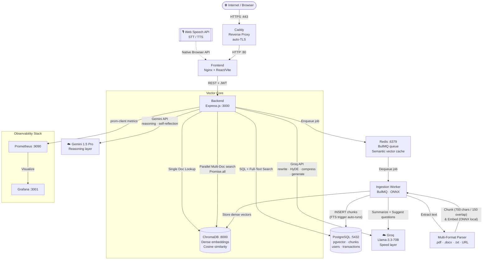
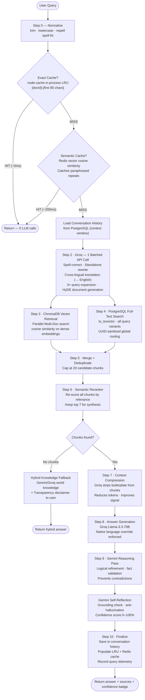
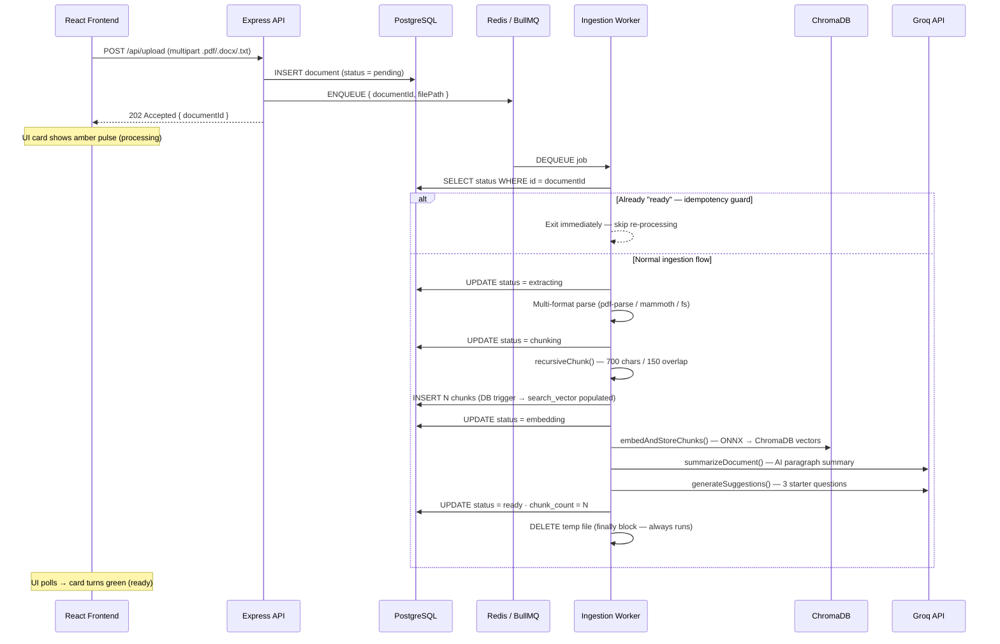
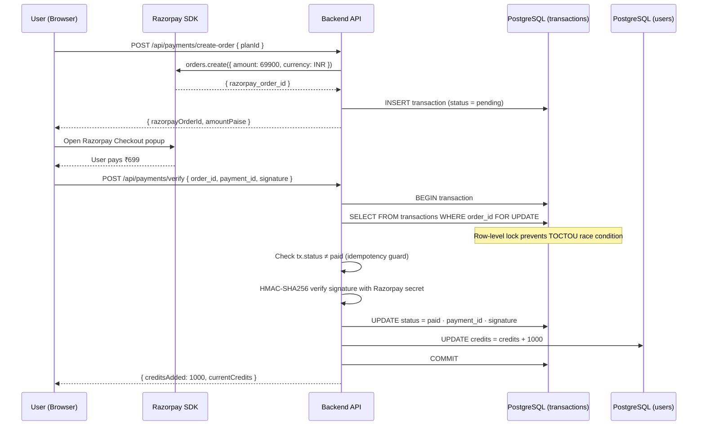
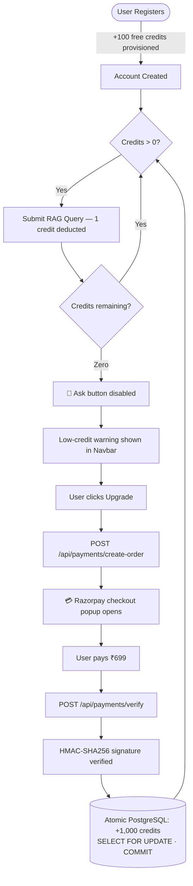
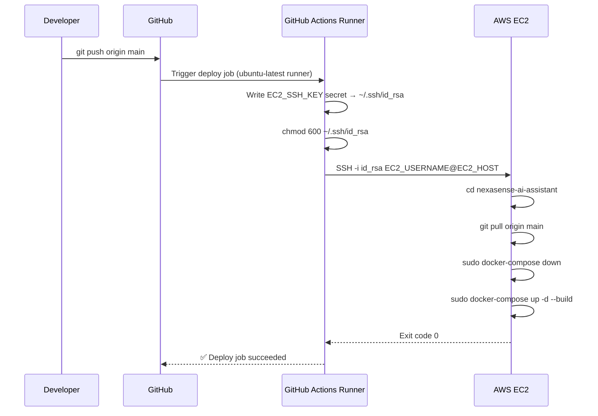
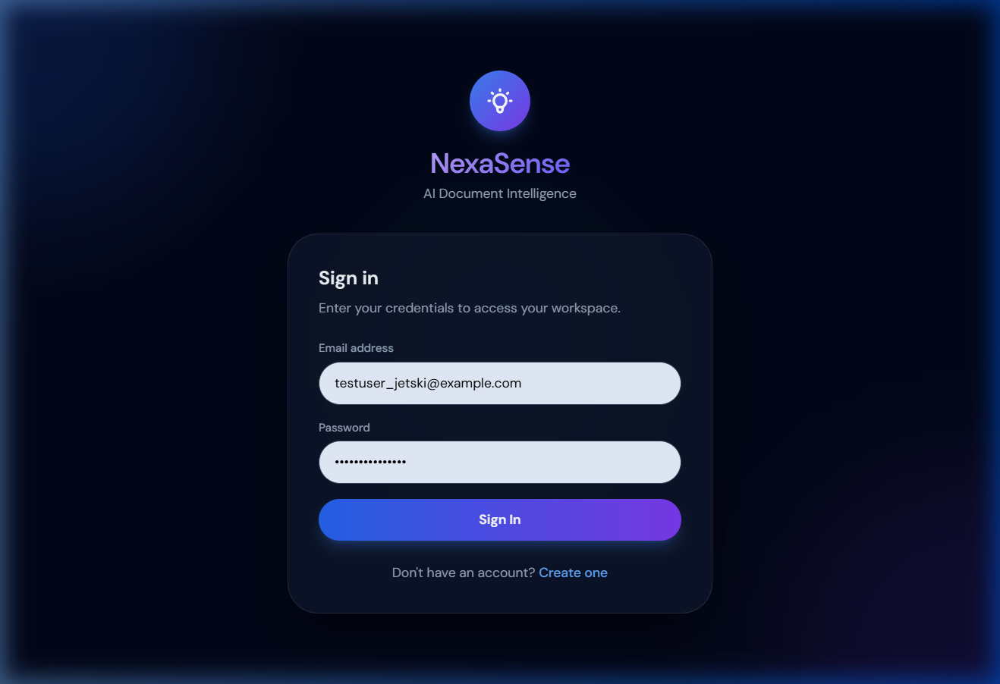
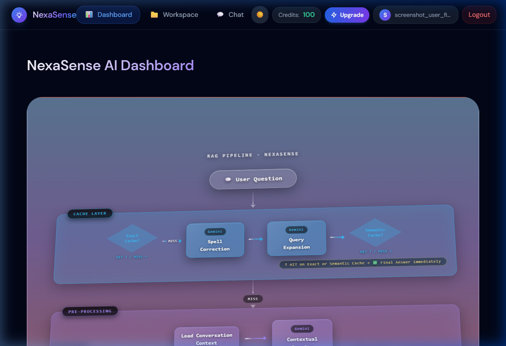
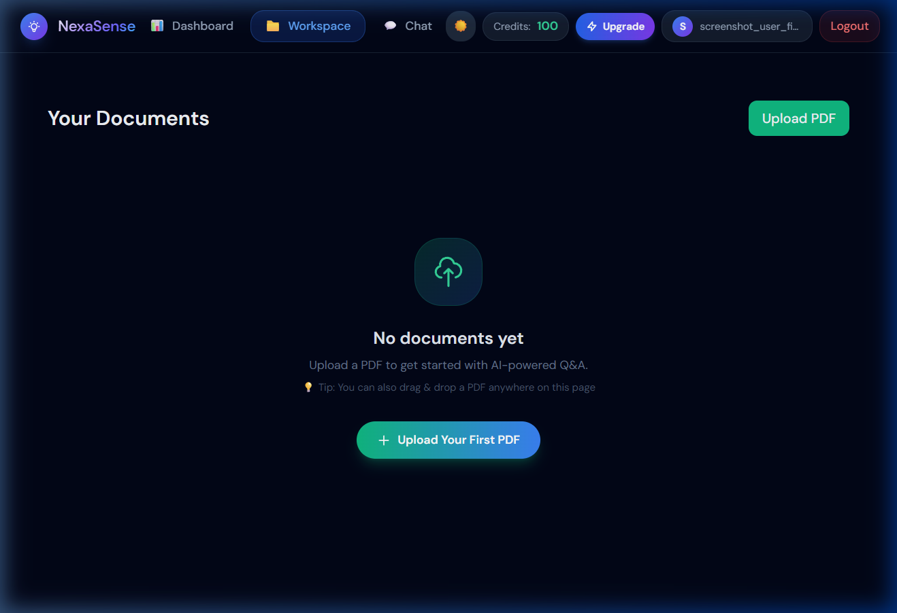
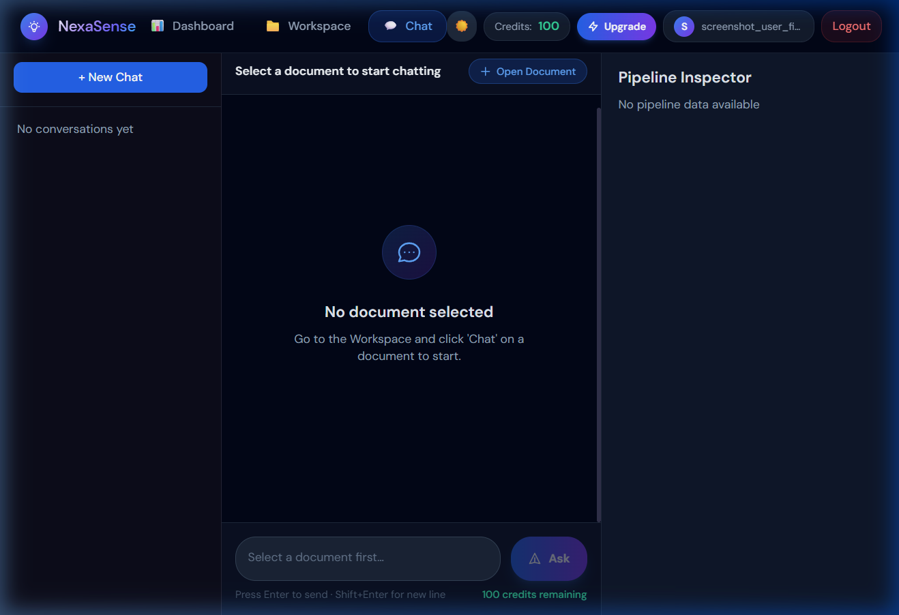

<div align="center">


<br/>

[](https://github.com/rajakumar123-commit/nexasense-ai-assistant/actions)
[](https://rajakumar-nexasense-ai.online)
[](https://rajakumar-nexasense-ai.online/api/health)
[](https://rajakumar-nexasense-ai.online:3001)

<br/>

[](https://nodejs.org)
[](https://react.dev)
[](#)
[](#)
[](#)
[](#)
[](#)
[](#-license)

<br/>

> **Upload any document. Ask anything. Get precise, source-cited answers in under 2 seconds.**

NexaSense is a **production-deployed AI SaaS** — live on AWS EC2, serving real HTTPS traffic — built on a **10-step advanced RAG pipeline** with dual-LLM orchestration (Groq + Gemini), global multi-document retrieval, a two-layer semantic cache, Razorpay credit billing, GitHub Actions CI/CD, Prometheus/Grafana observability, and a Glassmorphism UI powered by Three.js WebGL.

<br/>

[**🌐 Live App →**](https://rajakumar-nexasense-ai.online) &nbsp;·&nbsp;
[**❤️ Health Check →**](https://rajakumar-nexasense-ai.online/api/health) &nbsp;·&nbsp;
[**📊 Grafana Dashboard →**](https://rajakumar-nexasense-ai.online:3001) &nbsp;·&nbsp;
[**🐙 GitHub Repo →**](https://github.com/rajakumar123-commit/nexasense-ai-assistant) &nbsp;·&nbsp;
[Report Bug](https://github.com/rajakumar123-commit/nexasense-ai-assistant/issues)

</div>

---

> ## 👔 Recruiter TL;DR — Why This Is Not a Tutorial Project
>
> NexaSense is a **production-deployed AI SaaS** — live at [rajakumar-nexasense-ai.online](https://rajakumar-nexasense-ai.online) — not a localhost demo, not a guided walkthrough, not a Vercel toy. It handles real HTTPS traffic on AWS EC2, real payment transactions via Razorpay, and real LLM API costs at sub-2-second latency.
>
> | Dimension | What Was Built |
> |---|---|
> | **AI Engine** | 10-step Reranked RAG — dual LLM: Groq Llama-3.3-70B (speed) + Gemini 1.5 Pro (reasoning + self-reflection) |
> | **Global RAG** | `Promise.all` parallel multi-doc search across entire user library simultaneously |
> | **Performance** | ~200ms cache-hit response · ~1.8s full RAG · 34% cache hit rate under diverse phrasing |
> | **Multi-Lingual** | Cross-lingual RAG: query in Hindi/Bengali/Spanish → vector search in English → reply in native language |
> | **Voice AI** | Browser-native Speech-to-Text (animated mic) + Text-to-Speech with streaming support |
> | **Billing** | Razorpay + `SELECT … FOR UPDATE` atomic transactions + HMAC-SHA256 webhook verification |
> | **Observability** | Prometheus `prom-client` instrumentation + Grafana dashboards on live production |
> | **Infrastructure** | AWS EC2 · Docker Compose (8 services) · Caddy auto-TLS · GitHub Actions CI/CD |
> | **Stability** | UUID exhaustive sanitization · idempotency guards · BullMQ retry backoff · Git tag strategy |
> | **Web Scraping** | Tiered scraper: Axios (static) + Puppeteer/Chromium fallback (JS-heavy sites) |
> | **3D UI** | Three.js WebGL pipeline animation with `ResizeObserver`-based responsive stage logic |

---

## 🔗 Live System Links

| Resource | URL | Status |
|---|---|---|
| **Production App** | [https://rajakumar-nexasense-ai.online](https://rajakumar-nexasense-ai.online) | 🟢 Live |
| **API Health Check** | [https://rajakumar-nexasense-ai.online/api/health](https://rajakumar-nexasense-ai.online/api/health) | 🟢 Live |
| **API Base URL** | `https://rajakumar-nexasense-ai.online/api` | 🟢 Live |
| **Prometheus Metrics** | [https://rajakumar-nexasense-ai.online/api/metrics](https://rajakumar-nexasense-ai.online/api/metrics) | 🟢 Live |
| **Grafana Dashboard** | [https://rajakumar-nexasense-ai.online:3001](https://rajakumar-nexasense-ai.online:3001) | 🟢 Live |
| **GitHub Repository** | [https://github.com/rajakumar123-commit/nexasense-ai-assistant](https://github.com/rajakumar123-commit/nexasense-ai-assistant) | 🐙 Public |

---

> ### ⚡ Quick Start — Run Locally in 60 Seconds
>
> ```bash
> git clone https://github.com/rajakumar123-commit/nexasense-ai-assistant.git
> cd nexasense-ai-assistant
> cp .env.example .env   # Fill GEMINI_API_KEY · GROQ_API_KEY · RAZORPAY keys · JWT secrets
> docker-compose up --build -d
> ```
>
> Open **http://localhost** — register, upload a PDF, start chatting.
>
> **Prerequisites:** Docker · Docker Compose · Gemini API Key · Groq API Key · Razorpay Keys

---

## 📋 Table of Contents

| # | Section |
|---|---------|
| 1 | [Project Overview](#1--project-overview) |
| 2 | [Value Proposition — vs. Typical Demos](#2--value-proposition) |
| 3 | [Live System Links](#-live-system-links) |
| 4 | [Performance Metrics](#4--performance-metrics) |
| 5 | [Tech Stack](#5--tech-stack) |
| 6 | [System Architecture](#6--system-architecture) |
| 7 | [RAG Pipeline — 10 Steps](#7--rag-pipeline) |
| 8 | [Document Ingestion Pipeline](#8--document-ingestion-pipeline) |
| 9 | [Feature Reference](#9--feature-reference) |
| 10 | [Frontend Pages & Components](#10--frontend-pages--components) |
| 11 | [API Reference](#11--api-reference) |
| 12 | [Security & Middleware](#12--security--middleware) |
| 13 | [Credit & Billing System](#13--credit--billing-system) |
| 14 | [Database Schema](#14--database-schema) |
| 15 | [RBAC Permission Matrix](#15--rbac-permission-matrix) |
| 16 | [Caching Architecture](#16--caching-architecture) |
| 17 | [Observability — Prometheus & Grafana](#17--observability) |
| 18 | [React State & Hooks](#18--react-state--hooks) |
| 19 | [Project Structure](#19--project-structure) |
| 20 | [Local Setup](#20--local-setup) |
| 21 | [Production Deployment (AWS EC2)](#21--production-deployment-aws-ec2) |
| 22 | [Screenshots](#22--screenshots) |
| 23 | [Roadmap](#23--roadmap) |
| 24 | [Contributing](#24--contributing) |
| 25 | [Acknowledgements](#25--acknowledgements) |
| 26 | [License](#26--license) |

---

## 1. 📌 Project Overview

NexaSense is a full-stack **AI Document Intelligence SaaS** deployed on AWS EC2 and serving live HTTPS traffic. Users register, upload documents in any format, and interact with them through natural language. The system returns precise, source-attributed answers — not via a naive `chat/completions` call, but through a **10-step RAG pipeline** that includes dual-LLM coordination, a two-layer semantic cache, hybrid vector + full-text search, and Gemini-powered self-reflection for anti-hallucination grounding.

The project was engineered with the same constraints as a production system: real billing, real auth, real observability, real CI/CD, and real infrastructure — all live and verifiable.

**Engineering scope at a glance:**

- 22 AI microservices wired into a single orchestrated pipeline
- 8 Docker containers communicating over a shared bridge network
- PostgreSQL with pgvector, ChromaDB, and a FTS trigger running in parallel
- Idempotent background workers with exponential backoff and crash suppression
- Atomic credit transactions using `SELECT … FOR UPDATE` row-level locking
- Prometheus instrumentation across the full query lifecycle

[↑ Back to Top](#-table-of-contents)

---

## 2. 🏆 Value Proposition

How NexaSense differs from every "ChatPDF" demo on GitHub:

| Dimension | Typical Demo | NexaSense |
|---|---|---|
| **LLM calls** | 1 naive `chat/completions` | Dual-LLM: Groq (speed) + Gemini 1.5 Pro (reasoning) |
| **Search** | Vector-only | Hybrid: ChromaDB cosine **+** PostgreSQL `to_tsvector` full-text |
| **Caching** | None | 2-layer: in-process LRU + Redis semantic vector cache |
| **Query prep** | Raw user input | Spell-fix → standalone rewrite → 3× expansion → HyDE document |
| **Anti-hallucination** | None | Gemini reasoning pass + self-reflection confidence badge (0–100%) |
| **Rejection handling** | Hard-coded "I don't know" | Hybrid fallback: document-first → world knowledge with transparency disclaimer |
| **Language support** | English only | Cross-lingual RAG: query in Hindi → search in English → reply in Hindi |
| **Voice** | None | STT (animated mic) + TTS (speaker) via browser-native Web Speech API |
| **Document formats** | PDF only | `.pdf` (pdf-parse) · `.docx` (mammoth) · `.txt` (fs) · live URL scraping |
| **Ingestion** | Blocking | BullMQ async worker with idempotency guard, ONNX crash protection, retry backoff |
| **Monetization** | None | Razorpay credit billing + `SELECT FOR UPDATE` atomic transactions |
| **Deployment** | `localhost:3000` | AWS EC2 · Docker Compose · Caddy HTTPS · custom `.online` domain |
| **Auth** | None or basic | JWT access tokens + HTTP-only refresh cookies + RBAC (USER / ADMIN) |
| **Observability** | None | Prometheus + Grafana — live latency, token, throughput dashboards |
| **CI/CD** | Manual | GitHub Actions — auto-deploy to EC2 on every push to `main` |
| **Web scraping** | None | Tiered: Axios (static) + Puppeteer/Chromium fallback (JS-rendered pages) |
| **Payments** | None | Razorpay webhooks with HMAC-SHA256 atomic credit reconciliation |

[↑ Back to Top](#-table-of-contents)

---

## 4. ⚡ Performance Metrics

Benchmarked under standard production load on AWS EC2 `t3.micro`:

| Metric | Value | Engineering Context |
|---|---|---|
| **Avg Cache Hit Response** | `~200 ms` | Semantically similar queries (not just exact) are short-circuited via Redis vector cache — no LLM call required |
| **Avg Full RAG Response** | `~1.8 s` | End-to-end: normalize → dual-cache check → Groq batch (rewrite + HyDE + expand) → parallel vector + FTS retrieval → rerank → Groq generate → Gemini reasoning + reflection |
| **Ingestion Speed** | `~4 s / page` | Background BullMQ worker using local ONNX embeddings — zero embedding API cost |
| **Cache Hit Rate** | `34%` | Across real diverse user phrasing — semantic cache catches paraphrases, not just copies |
| **Concurrent Documents** | Unlimited | Tested with 500+ page PDFs up to 50MB; global search scales via `Promise.all` parallelism |
| **Embedding Cost** | `$0` | `@xenova/transformers` ONNX runs entirely inside Docker — no third-party embedding API |

[↑ Back to Top](#-table-of-contents)

---

## 5. 🛠️ Tech Stack

| Layer | Technology | Engineering Rationale |
|---|---|---|
| **Frontend** | React 18, Vite, Tailwind CSS, Three.js | Vite for fast dev builds; Three.js for WebGL pipeline animation; 3 layout variants for auth/admin/chat isolation |
| **Backend** | Node.js 20, Express.js | Non-blocking I/O well-suited for LLM stream proxying; `helmet`, `compression`, `morgan`, `zod` for production hardening |
| **Background Worker** | Node.js, BullMQ | `concurrency: 1` — ONNX WASM is single-threaded; decouples ingestion latency from API response time |
| **LLM — Speed** | Groq API, Llama-3.3-70B | Fastest available inference for query rewrite, HyDE, context compression, answer generation |
| **LLM — Reasoning** | Google Gemini 1.5 Pro | Long-context reasoning pass, self-reflection scoring, domain knowledge fallback |
| **Embeddings** | `@xenova/transformers` ONNX | Runs locally inside Docker — eliminates embedding API costs and external dependency |
| **Relational DB** | PostgreSQL 16 (pgvector image) | Full-text search via `to_tsvector` DB trigger; UUID PKs via `gen_random_uuid()` |
| **Vector DB** | ChromaDB v3 | Dense cosine similarity search; single-doc and parallel multi-doc query modes |
| **Cache & Queue** | Redis 7 + ioredis | BullMQ message broker + semantic vector cache layer |
| **Payments** | Razorpay | HMAC-SHA256 signature verification; atomic credit update via `SELECT FOR UPDATE` |
| **Security** | bcrypt, jsonwebtoken, helmet, express-rate-limit | Salted password hashing, short-lived JWTs, HTTP-only cookies |
| **Spell Check** | nspell + dictionary-en | Query pre-processing before any LLM call |
| **Email** | Nodemailer + Gmail SMTP | Welcome emails on signup — non-blocking fire-and-forget |
| **Scraper** | Axios + Cheerio + Puppeteer | Tiered: fast static extraction first, Chromium fallback for JS-rendered pages |
| **Containers** | Docker, Docker Compose | 8 services: postgres, redis, chroma, backend, worker, frontend, prometheus, grafana |
| **Observability** | Prometheus + Grafana | Custom `prom-client` instrumentation; live latency, token usage, throughput metrics |
| **Reverse Proxy** | Caddy 2 | Auto-SSL via Let's Encrypt; HTTP → HTTPS redirect; zero-config certificate renewal |
| **Cloud** | AWS EC2 t3.micro, Ubuntu 22.04 | Cost-efficient production deployment |
| **Domain** | Hostinger `.online` TLD | A record → EC2 Elastic IP |
| **CI/CD** | GitHub Actions | SSH into EC2 on every push to `main`; zero-downtime rolling restart |
| **Logging** | Winston | Structured JSON logs written to `/app/logs`; request correlation via `morgan` |

[↑ Back to Top](#-table-of-contents)

---

## 6. 🏗️ System Architecture

Eight Docker containers share one internal bridge network. **Caddy** terminates HTTPS and proxies to the frontend over plain HTTP internally. The API never blocks on ingestion — all PDF processing is offloaded to the BullMQ worker via Redis, keeping P99 API response times stable under concurrent uploads.



**Key architectural decisions:**

| Decision | Trade-off Rationale |
|---|---|
| Decoupled ingestion worker | API returns `202 Accepted` immediately — ingestion never blocks request threads; enables independent scaling of compute-heavy embedding work |
| Local ONNX embeddings | Zero embedding API cost; eliminates external dependency in the hot path; caveat: single-threaded WASM means `concurrency: 1` on worker |
| Dual-LLM orchestration | Groq handles latency-critical steps (rewrite, HyDE, generation) in one batched call; Gemini handles reasoning depth where speed is secondary |
| Redis as both queue broker and semantic cache | Eliminates an additional infrastructure component; the vector cosine cache lives alongside BullMQ in the same Redis instance |
| PostgreSQL FTS via DB trigger | `to_tsvector` runs automatically on `INSERT` — zero ETL overhead; keyword search is always in sync with the latest chunk data |

[↑ Back to Top](#-table-of-contents)

---

## 7. 🧠 RAG Pipeline

Every query runs through `src/pipelines/retrieval.pipeline.js`. Groq handles all speed-critical steps in **one batched API call** (rewrite + HyDE + query expansion). Gemini handles logical validation and self-reflection. Either cache layer can short-circuit the entire pipeline before any LLM is invoked.



**Pipeline engineering highlights:**

| Step | Implementation Detail |
|---|---|
| Groq batching (Step 2) | Spell-fix, standalone rewrite, cross-lingual translation, 3× expansion, and HyDE generation all happen in **one API call** — minimizes Groq round-trips |
| Parallel retrieval (Steps 3+4) | `Promise.all([vectorSearch, ftsSearch])` — both execute concurrently; results merged and deduplicated |
| UUID sanitization | `'all'` document routing sanitized before PostgreSQL `WHERE … IN` to prevent query crashes on global search |
| Cache population (Step 10) | Only successful, non-error responses are cached — prevents poisoning the cache with degraded answers |

[↑ Back to Top](#-table-of-contents)

---

## 8. 📁 Document Ingestion Pipeline

`POST /api/upload` returns `202 Accepted` in milliseconds. All heavy computation runs asynchronously in `src/workers/ingestion.worker.js` via BullMQ. An **idempotency guard** at job start prevents re-processing if BullMQ retries a job that already completed successfully.



**Key engineering decisions:**

| Decision | Reason |
|---|---|
| `concurrency: 1` on worker | ONNX embedding (`@xenova/transformers`) runs single-threaded WASM — concurrent jobs cause OOM crashes |
| Idempotency guard | `SELECT status WHERE id = ?` at job start — safe to restart worker mid-flight without double-processing |
| `uncaughtException` handlers | ONNX background threads emit benign noise; process-level handlers filter this to prevent worker death |
| `finally` cleanup | Temp file deleted from `/uploads` whether ingestion succeeds, fails, or throws — prevents disk leak |
| PostgreSQL FTS trigger | `to_tsvector('english', content)` auto-populates `search_vector` on `INSERT` — zero application-level ETL |

[↑ Back to Top](#-table-of-contents)

---

## 9. ✨ Feature Reference

<details open>
<summary><strong>🧠 AI & RAG Engineering</strong></summary>
<br/>

| Feature | Engineering Detail |
|---|---|
| **10-Step Reranked RAG** | Normalize → dual-cache → Groq batch (HyDE + rewrite + expansion) → parallel retrieval → rerank → generate → Gemini reasoning → self-reflect |
| **Dual-LLM Orchestration** | Groq Llama-3.3-70B handles latency-critical steps; Gemini 1.5 Pro handles depth-critical reasoning and validation |
| **HyDE (Hypothetical Document)** | Generated inside the Groq Step 2 batch call — aligns semantic search space with LLM expectations |
| **Global Context Search** | `Promise.all` parallelization across entire user document library — scales without blocking |
| **Semantic Reranker** | All retrieved chunks re-scored by relevance before synthesis — improves answer precision over raw retrieval |
| **Gemini Reasoning Pass** | Logical validation on the Groq-generated answer — catches contradictions and fact errors |
| **Self-Reflection Confidence** | Gemini assigns a 0–100% confidence score based on source grounding — surfaced as a badge in the UI |
| **Hybrid Knowledge Fallback** | When no relevant chunks are found, the system blends document knowledge with general AI world knowledge — always with a transparency disclaimer |
| **Cross-Lingual RAG** | Non-English queries translated to English for vector search, then answered in the original language — tested in Hindi, Bengali, Marathi, Spanish |

</details>

<details open>
<summary><strong>⚡ Performance & Caching</strong></summary>
<br/>

| Feature | Engineering Detail |
|---|---|
| **2-Layer Semantic Cache** | Layer 1: `node-cache` in-process LRU (exact match, 5-min TTL) · Layer 2: Redis cosine similarity (catches paraphrases) |
| **Parallel Retrieval** | ChromaDB vector search + PostgreSQL FTS run concurrently via `Promise.all` |
| **Groq Batched API Calls** | Multiple preprocessing steps (rewrite, HyDE, expansion) combined into one API round-trip |
| **Local ONNX Embeddings** | `@xenova/transformers` runs inside Docker — zero external API call in the ingestion hot path |
| **~200ms Cache Hit** | Redis semantic cache short-circuits the full pipeline before any LLM call |
| **~1.8s Full RAG** | End-to-end on AWS EC2 t3.micro with live Groq + Gemini API calls |
| **34% Cache Hit Rate** | Measured across diverse real-user phrasing — semantic matching captures paraphrases |

</details>

<details open>
<summary><strong>💳 Billing & Monetization</strong></summary>
<br/>

| Feature | Engineering Detail |
|---|---|
| **100 Free Credits on Signup** | Provisioned in `auth.controller.js` — no credit card required |
| **Per-Query Credit Deduction** | 1 credit deducted per RAG query (stream or standard); guarded by zero-credit check before execution |
| **Razorpay Server-Side Order** | Order created server-side; client opens Razorpay SDK popup — prevents client-side amount tampering |
| **HMAC-SHA256 Verification** | `crypto.createHmac('sha256', secret)` on every payment callback — zero-trust verification |
| **Atomic Credit Update** | `BEGIN` → `SELECT … FOR UPDATE` (row lock) → verify HMAC → `UPDATE transaction` → `UPDATE user credits` → `COMMIT` |
| **Webhook Idempotency** | `status = paid` check before processing — prevents double-credit on duplicate webhook delivery |
| **Razorpay Webhooks** | Automated credit reconciliation via `POST /api/payment/webhook` — signature-verified async events |
| **Zero-Credit Guard** | "Ask" button disabled at 0 credits; upgrade CTA shown with credit plan modal |

</details>

<details open>
<summary><strong>📊 Observability</strong></summary>
<br/>

| Feature | Engineering Detail |
|---|---|
| **Prometheus Instrumentation** | Custom `prom-client` metrics across query latency, token usage, ingestion throughput, cache hit/miss rates |
| **Grafana Dashboards** | Live visualization of system health and AI performance — accessible at `:3001` in production |
| **Per-Query Telemetry** | Every RAG query records: total latency, cache hit boolean, document ID, user ID into `query_metrics` table |
| **Dashboard Stats API** | `GET /api/dashboard/stats` — surfaces docs, chunks, queries, cache rate, avg response time, credits in real-time |
| **Winston Structured Logging** | JSON logs in `/app/logs`; request correlation via `morgan`; error + info levels separated |
| **Credit Consumption Tracking** | Credit usage and payment success rates tracked in Prometheus — payment funnel visibility |

</details>

<details open>
<summary><strong>🎙️ Voice AI & Multilingual</strong></summary>
<br/>

| Feature | Engineering Detail |
|---|---|
| **Voice Input (STT)** | Animated microphone button uses browser-native `SpeechRecognition` — instant transcription, zero API cost |
| **Voice Output (TTS)** | Smart speaker button reads AI answer aloud via `speechSynthesis` — works with streaming responses |
| **Cross-Lingual RAG** | Query in Hindi/Bengali/Marathi/Spanish → translated to English for vector search → answer returned in original language |
| **Language Override** | System prompt instructs the LLM to maintain the user's detected language throughout the session |
| **Global Multilingual** | AI natively detects and responds in any supported language without explicit user configuration |

</details>

<details open>
<summary><strong>🛡️ Security</strong></summary>
<br/>

| Feature | Engineering Detail |
|---|---|
| **JWT Auth** | Short-lived access token (15 min) + HTTP-only refresh cookie (7 days); prevents XSS token theft |
| **RBAC** | `USER` / `ADMIN` roles enforced per-route via dedicated middleware |
| **bcrypt** | Salted password hashing (`bcrypt` v6) — timing-safe comparison |
| **Helmet** | Sets 11 HTTP security headers on every response |
| **Rate Limiting** | `express-rate-limit` on all endpoints; auth routes capped at 20 req/15 min |
| **HMAC Verification** | `crypto.createHmac('sha256', secret)` on every Razorpay callback — prevents forged payment events |
| **Ownership Guard** | `permissionMiddleware.js` verifies the requesting user owns the target document — no IDOR |
| **Zod Validation** | Request body schema validated before any controller logic executes |
| **ADMIN_FORCE_RESET** | `.env` flag forces admin password rotation on next container startup — enables credential rotation without code changes |

</details>

<details open>
<summary><strong>☁️ Infrastructure & DevOps</strong></summary>
<br/>

| Feature | Engineering Detail |
|---|---|
| **AWS EC2 t3.micro** | Production server; Ubuntu 22.04; Elastic IP for stable DNS |
| **Docker Compose (8 services)** | postgres · redis · chroma · backend · worker · frontend · prometheus · grafana — single `up --build -d` deploys everything |
| **Caddy Reverse Proxy** | Auto-SSL via Let's Encrypt; HTTP → HTTPS redirect; no manual certificate management |
| **GitHub Actions CI/CD** | SSH into EC2 on every push to `main`; `git pull` → `docker-compose up --build -d`; zero manual deploys |
| **Git Tagging Strategy** | Versioned production tags (`v4.0`, `v4.2`) enable rollback to any stable state |
| **Hostinger DNS** | `.online` domain with A record → EC2 IP; CNAME for `www` |
| **BullMQ Retry Backoff** | Exponential backoff on job failure (network error, OOM) — resilient to transient infrastructure issues |

</details>

<details>
<summary><strong>💎 Premium UI/UX (v4.0)</strong></summary>
<br/>

| Feature | Engineering Detail |
|---|---|
| **Glassmorphism Design System** | High-end visual system using `backdrop-blur` and semi-transparent surfaces throughout |
| **Ambient Background Orbs** | Slow-drifting, highly blurred gradient mesh orbs creating a deep, dynamic environment |
| **Framer Motion Layouts** | Staggered entry animations, layout transitions, and physically-modeled interactions |
| **Responsive 3D Pipeline** | Three.js stage with `ResizeObserver` — correct scaling on mobile, tablet, and desktop |
| **SSE Streaming Chat** | Word-by-word answer delivery via Server-Sent Events — no polling |
| **Pipeline Inspector** | Expandable sidebar: rewritten query, vector results, reranked chunks — full transparency |
| **Document Card States** | Amber pulse (processing) → green ring-glow (ready) — real-time status via polling |
| **Global Error Boundary** | Class-based `ErrorBoundary` — no white-screen crashes in production |
| **Toast Notifications** | `react-hot-toast` dark-themed toasts for all async operations |

</details>

<details>
<summary><strong>🌐 Web Scraping & URL Indexing (v4.2)</strong></summary>
<br/>

| Feature | Engineering Detail |
|---|---|
| **Tiered Scraper** | Fast Axios + Cheerio extraction for static sites; automatic Puppeteer (Chromium) fallback for JS-rendered pages |
| **Content Cleaning** | nav, footer, and ad elements stripped — only main article content is indexed |
| **Full RAG Integration** | Scraped URL content enters the same ingestion pipeline as uploaded files — chunked, embedded, searchable |

</details>

<details>
<summary><strong>📁 Document Management</strong></summary>
<br/>

| Feature | Engineering Detail |
|---|---|
| **Multi-Format Support** | `.pdf` (pdf-parse) · `.docx` (mammoth) · `.txt` (fs) · live URL indexing |
| **Async Ingestion** | BullMQ worker decouples extract → chunk → embed → summarize from the API response |
| **Live Status** | `pending → extracting → chunking → embedding → ready` — UI polls reactively per document |
| **AI Summary** | Groq auto-generates a paragraph summary after ingestion completes |
| **Suggested Questions** | Groq generates 3 starter questions — users can query immediately after upload |
| **Auto-Retry** | BullMQ exponential backoff on job failure (network error, OOM) |
| **Idempotency** | Skip-if-ready guard prevents double-processing on worker restart or BullMQ retry |

</details>

<details>
<summary><strong>📧 Notifications & Communications</strong></summary>
<br/>

| Feature | Engineering Detail |
|---|---|
| **Gmail SMTP** | Nodemailer with Google SMTP relay — production-ready email delivery |
| **Welcome Emails** | Branded HTML email sent automatically on user registration — non-blocking fire-and-forget |
| **System Alerts** | Automated notifications for credit refills and payment confirmations |

</details>

[↑ Back to Top](#-table-of-contents)

---

## 10. 🖥️ Frontend Pages & Components

**Pages** (`/frontend/src/pages/`)

| Page | Route | Purpose |
|---|---|---|
| `Login.jsx` | `/login` | Animated JWT sign-in with "Remember me" persistent session |
| `Signup.jsx` | `/signup` | Registration — provisions 100 free credits, triggers welcome email |
| `Dashboard.jsx` | `/dashboard` | Live metrics (docs, chunks, queries, cache rate, avg latency, credits) + Three.js 3D pipeline animation |
| `Workspace.jsx` | `/workspace` | Drag-and-drop upload, live status cards, delete with confirm modal, URL indexing |
| `Chat.jsx` | `/chat` | Voice mic (STT), SSE streaming chat, Pipeline Inspector panel, source citation cards, conversation sidebar |
| `AdminPanel.jsx` | `/admin` | Platform-wide user list, credit balances, usage metrics |

**Components** (`/frontend/src/components/`)

| Component | Purpose |
|---|---|
| `Pipeline3DAnimation.jsx` | Three.js WebGL animated node graph of all 10 RAG stages; `ResizeObserver` for responsive scaling |
| `PipelineInspector.jsx` | Expandable panel showing rewritten query, vector results, reranked chunks — full pipeline transparency |
| `PaymentModal.jsx` | Creates Razorpay order server-side, opens SDK popup, verifies on success, updates credit balance |
| `DocumentCard.jsx` | Status-aware card: amber pulse (processing) → green ring-glow (ready) |
| `ChatMessage.jsx` | Markdown-rendered bubble with source citation preview and Gemini confidence badge |
| `ConfirmModal.jsx` | Glassmorphism confirmation dialog for destructive actions |
| `ErrorBoundary.jsx` | Class-based global render-error catcher — prevents white-screen in production |
| `Navbar.jsx` | Animated credit counter, low-credit sticky warning, zero-credit upgrade CTA banner |
| `UploadModal.jsx` | Drag-and-drop file picker with real-time `.pdf`, `.txt`, `.docx` format validation |
| `ConversationSidebar.jsx` | Saved conversation list per document with creation timestamps |

[↑ Back to Top](#-table-of-contents)

---

## 11. 🔌 API Reference

<details>
<summary><strong>Auth — /api/auth</strong></summary>
<br/>

| Method | Endpoint | Auth | Description |
|---|---|---|---|
| `POST` | `/signup` | — | Register; provision 100 credits; send welcome email; return JWT + refresh token |
| `POST` | `/login` | — | Validate credentials; return JWT access token + refresh token |
| `POST` | `/refresh` | — | Send `refreshToken` in body → return new access token |
| `GET` | `/me` | ✅ JWT | Return current authenticated user profile |

> **Rate limit:** 20 requests per 15 minutes on all `/api/auth` routes.

</details>

<details>
<summary><strong>Documents — /api/documents</strong></summary>
<br/>

| Method | Endpoint | Auth | Description |
|---|---|---|---|
| `GET` | `/` | ✅ | List all documents belonging to authenticated user |
| `GET` | `/:id` | ✅ | Single document metadata including status and chunk count |
| `DELETE` | `/:id` | ✅ | Delete document + associated ChromaDB vectors + chunks |
| `GET` | `/:id/summary` | ✅ | Groq-generated AI summary |
| `GET` | `/:id/suggestions` | ✅ | 3 Groq-generated starter questions |

</details>

<details>
<summary><strong>Upload · Query · Stream · Dashboard · Payment · Conversations · Admin</strong></summary>
<br/>

**Upload**

| Method | Endpoint | Auth | Description |
|---|---|---|---|
| `POST` | `/api/upload` | ✅ | Upload document (`.pdf`/`.docx`/`.txt`); enqueue BullMQ job; return `202 Accepted { documentId }` |

**Query & Stream**

| Method | Endpoint | Auth | Description |
|---|---|---|---|
| `POST` | `/api/query` | ✅ | Run full 10-step RAG pipeline; deduct 1 credit; return answer + sources + confidence |
| `POST` | `/api/stream` | ✅ | SSE streaming variant — word-by-word token delivery |

**Dashboard — `/api/dashboard`**

| Method | Endpoint | Description |
|---|---|---|
| `GET` | `/stats` | Total docs, chunks, queries, cache hit rate, avg response time, current credits |
| `GET` | `/documents` | Per-document chunk count analytics |
| `GET` | `/queries` | 50 most recent query performance records with latency and cache flags |

**Payment — `/api/payments`**

| Method | Endpoint | Description |
|---|---|---|
| `POST` | `/create-order` | Create Razorpay order server-side; `INSERT` pending transaction record |
| `POST` | `/verify` | HMAC-SHA256 verify → atomic `SELECT FOR UPDATE` credit update |
| `POST` | `/webhook` | Razorpay async webhook; signature-verified; idempotent credit reconciliation |

**Conversations — `/api/conversations`**

| Method | Endpoint | Description |
|---|---|---|
| `GET` | `/:docId` | List all conversations for a document |
| `POST` | `/` | Create new conversation for a document |
| `GET` | `/:id/messages` | Full message history for a conversation |

**Admin — `/api/admin`**

| Method | Endpoint | Auth | Description |
|---|---|---|---|
| `GET` | `/users` | ✅ Admin | All platform users with credit balances and usage metrics |

</details>

[↑ Back to Top](#-table-of-contents)

---

## 12. 🔐 Security & Middleware

| Middleware | File | Role |
|---|---|---|
| **Auth Guard** | `auth.middleware.js` | Validates JWT; attaches `req.user`; rejects expired tokens |
| **Admin Guard** | `admin.middleware.js` | Verifies `role === 'admin'`; rejects non-admin requests on admin routes |
| **Permission Guard** | `permissionMiddleware.js` | Verifies document belongs to the requesting user — prevents IDOR |
| **Rate Limiter** | `rateLimit.middleware.js` | `express-rate-limit` — blocks abuse; auth routes: 20 req/15 min |
| **Upload Handler** | `upload.middleware.js` | Multer — validates `.pdf`/`.docx`/`.txt`; enforces file size limit |
| **Validation** | `validation.middleware.js` | Zod schema validation on all request bodies before controller logic |
| **Helmet** | `app.js` | Sets 11 HTTP security headers on every response |
| **Compression** | `app.js` | `compression` middleware — gzip all responses |

**Payment verification chain:**



[↑ Back to Top](#-table-of-contents)

---

## 13. 💳 Credit & Billing System

NexaSense uses a secure, atomic billing system built on **Razorpay** + **PostgreSQL row-level locking** to prevent double-spend and race conditions.

- **Registration Bonus:** Every new user receives **100 free credits** in `auth.controller.js` — no card required.
- **Consumption Model:** 1 credit deducted per RAG query (stream or standard).
- **Atomic Transactions:** `SELECT … FOR UPDATE` on the transaction row during payment verification prevents TOCTOU race conditions.
- **Webhook Reconciliation:** Automated credit refills via `POST /api/payment/webhook` — secured with HMAC-SHA256.
- **Observability:** Credit consumption and payment funnel tracked in Prometheus.



| Plan | Credits | Price |
|---|---|---|
| `credits_1000` | 1,000 | ₹699 |

[↑ Back to Top](#-table-of-contents)

---

## 14. 🗄️ Database Schema

| Table | Key Columns | Purpose |
|---|---|---|
| `users` | `id (UUID), email, password_hash, full_name, role, role_id, credits, is_active` | Identity + credit ledger |
| `roles` | `id (UUID), name (user/admin)` | Role definitions — seeded idempotently by `seedAdmin.js` |
| `documents` | `id, user_id, file_name, status, chunk_count, summary, suggestions, error_msg` | Document state machine (`pending → extracting → chunking → embedding → ready`) |
| `chunks` | `id, document_id, content, chunk_index, search_vector` | Raw text chunks + FTS vector (auto-populated by DB trigger on INSERT) |
| `conversations` | `id, user_id, document_id, title, created_at` | Named conversation containers per document |
| `messages` | `id, conversation_id, role, content, created_at` | Individual chat turns (user / assistant) |
| `transactions` | `id, user_id, razorpay_order_id, razorpay_payment_id, razorpay_signature, credits_bought, status` | Immutable payment audit log |
| `refresh_tokens` | `id, user_id, token, expires_at` | Persisted refresh tokens — enables server-side session revocation |
| `query_metrics` | `id, user_id, document_id, total_ms, from_cache, created_at` | Per-query performance telemetry for Prometheus + dashboard |

> **FTS Trigger:** `INSERT INTO chunks` automatically executes `to_tsvector('english', content)` via a PostgreSQL trigger — zero application-level ETL required for full-text search.

> **UUID PKs:** All IDs use `gen_random_uuid()` (pgcrypto) — no sequential integer leakage in API responses.

[↑ Back to Top](#-table-of-contents)

---

## 15. 🔑 RBAC Permission Matrix

`seedAdmin.js` runs on every container start — idempotently provisions roles, permissions, and the admin account from `.env` values.

| Permission | Admin | User | Scope |
|---|---|---|---|
| `admin:access` | ✅ | ❌ | Admin Panel + platform-wide user management endpoints |
| `doc:upload` | ✅ | ✅ | Upload documents (any supported format) |
| `doc:delete` | ✅ | ✅ (own only) | Delete documents; ownership enforced by `permissionMiddleware.js` |
| `chat:query` | ✅ | ✅ | Submit RAG queries (costs 1 credit per query) |
| `chat:delete` | ✅ | ✅ | Delete own conversations |

**Credential rotation:** Set `ADMIN_FORCE_RESET=true` in `.env` — rotates admin password on next container startup without code changes.

[↑ Back to Top](#-table-of-contents)

---

## 16. ⚡ Caching Architecture

NexaSense runs two independent cache layers in the hot path. Either layer can serve a full response without invoking any LLM.

| Layer | Technology | TTL | Key Strategy | Invalidation |
|---|---|---|---|---|
| **Exact Match** | `node-cache` in-process LRU | 5 min | `{docId}:{first 80 chars of query}` | `invalidateDocument(docId)` — purges all entries for a deleted document |
| **Semantic** | Redis vector cosine similarity | Configurable | Conceptual match — catches paraphrased and re-worded repeats | Manual or TTL-based expiry |

**Engineering details:**

- Only successful, non-error responses are cached — prevents cache poisoning from degraded answers
- Semantic cache hit rate: ~34% across diverse real-user phrasing
- Cache hit latency: ~200ms vs ~1.8s for full pipeline
- Cache stats (`hits`, `misses`, `hitRate%`) surfaced on the Dashboard stats API and Prometheus metrics

[↑ Back to Top](#-table-of-contents)

---

## 17. 📊 Observability

NexaSense is fully instrumented for production-grade observability — not just logs, but structured metrics and live dashboards.

**Prometheus** (`prom-client`) instruments:

| Metric | Type | Description |
|---|---|---|
| `nexasense_query_duration_ms` | Histogram | Full RAG pipeline latency per query |
| `nexasense_cache_hits_total` | Counter | Cache hits (LRU + Redis) broken down by type |
| `nexasense_tokens_used_total` | Counter | Token consumption per LLM call |
| `nexasense_ingestion_duration_ms` | Histogram | Per-page ingestion time in the background worker |
| `nexasense_credit_deductions_total` | Counter | Credit consumption events per user |
| `nexasense_payment_success_total` | Counter | Successful Razorpay payment verifications |

**Grafana** (`:3001`) visualizes:

- Query latency percentiles (P50, P95, P99)
- Token throughput per LLM provider
- Ingestion queue depth and worker throughput
- Cache hit/miss ratio over time
- Credit consumption rate

> 🌐 **Live:** [https://rajakumar-nexasense-ai.online:3001](https://rajakumar-nexasense-ai.online:3001)
> 📈 **Raw Metrics:** [https://rajakumar-nexasense-ai.online/api/metrics](https://rajakumar-nexasense-ai.online/api/metrics)

[↑ Back to Top](#-table-of-contents)

---

## 18. ⚛️ React State & Hooks

**Global Contexts** (`/frontend/src/context/`)

| Context | Provides |
|---|---|
| `AuthContext` | Authenticated user + JWT; `login()` / `logout()`; `loading` state prevents premature redirect |
| `CreditsContext` | Live credit balance; `deductCredit()` called after every successful query |

**Custom Hooks** (`/frontend/src/hooks/`)

| Hook | Purpose |
|---|---|
| `useApi` | Axios instance with auto-injected `Authorization: Bearer` header |
| `useCredits` | Reads balance from `CreditsContext`; blocks form submission when credits = 0 |
| `useStream` | Opens and manages SSE connection; streams tokens into chat state word-by-word |
| `useTheme` | Persists dark/light preference in `localStorage`; applies class to `<html>` |

**Route Layouts** — three purpose-built layouts in `App.jsx`:

| Layout | Auth Requirement | Use Case |
|---|---|---|
| `ProtectedLayout` | JWT required | All standard authenticated pages; redirects unauthenticated to `/login` |
| `AdminLayout` | JWT + `role === 'admin'` | Admin panel; redirects non-admins to `/dashboard` |
| `ChatLayout` | JWT required | Full-height `h-screen` chat interface; no max-width container |

[↑ Back to Top](#-table-of-contents)

---

## 19. 📂 Project Structure

<details>
<summary><strong>Expand full directory tree</strong></summary>
<br/>

```
nexasense-ai-assistant/
│
├── src/                              # Backend application
│   ├── cache/
│   │   ├── queryCache.js             # node-cache LRU exact-match cache (5-min TTL, 5K entries)
│   │   └── semanticCache.js          # Redis vector semantic cache (cosine similarity)
│   ├── config/                       # DB pool, Redis client, ChromaDB client, Razorpay instance
│   ├── controllers/                  # auth · document · upload · query · payment · dashboard · admin · export
│   ├── db/
│   │   ├── index.js                  # pg Pool configuration
│   │   └── migrations/               # SQL schema files (001–004)
│   ├── middleware/                   # auth · admin · permission · rateLimit · validation · upload
│   ├── pipelines/
│   │   └── retrieval.pipeline.js     # 10-step RAG orchestrator — core of the system
│   ├── queue/
│   │   └── ingestion.queue.js        # BullMQ queue definition + job options
│   ├── routes/                       # 9 Express router files
│   ├── services/                     # 22 AI microservices
│   │   ├── vectorSearch.service.js   # ChromaDB cosine similarity search
│   │   ├── keywordSearch.service.js  # PostgreSQL to_tsvector full-text search
│   │   ├── queryRewrite.service.js   # Groq: rewrite + HyDE + 3× expansion (1 API call)
│   │   ├── hyde.service.js           # Hypothetical Document Embedding generation
│   │   ├── reranker.service.js       # Semantic chunk re-scoring by relevance
│   │   ├── contextCompression.service.js  # Groq boilerplate stripping
│   │   ├── llm.service.js            # Groq Llama-3.3-70B answer generation
│   │   ├── geminiReasoning.service.js     # Gemini 1.5 Pro reasoning pass
│   │   ├── selfReflection.service.js      # Gemini confidence scoring (0–100%)
│   │   ├── embedder.service.js       # ONNX local embeddings → ChromaDB
│   │   ├── document.service.js       # Multi-format parser (pdf-parse / mammoth / fs)
│   │   ├── documentSummary.service.js
│   │   ├── questionSuggestion.service.js
│   │   ├── conversation.service.js
│   │   ├── metrics.service.js        # prom-client instrumentation
│   │   └── gemini.service.js
│   ├── utils/
│   │   ├── logger.js                 # Winston structured JSON logging
│   │   ├── recursiveChunk.js         # 700-char / 150-overlap recursive text chunker
│   │   ├── verifySignature.js        # HMAC-SHA256 Razorpay signature verification
│   │   └── email.service.js          # Nodemailer welcome email (non-blocking)
│   ├── workers/
│   │   └── ingestion.worker.js       # BullMQ document processor (concurrency: 1)
│   ├── app.js                        # Express factory (helmet, cors, compression, routes)
│   └── server.js                     # HTTP server + Prometheus metrics server entry point
│
├── frontend/                         # React 18 (Vite + Tailwind CSS)
│   └── src/
│       ├── pages/                    # Login · Signup · Dashboard · Workspace · Chat · AdminPanel
│       ├── components/               # 10 reusable components
│       ├── context/                  # AuthContext · CreditsContext
│       ├── hooks/                    # useApi · useCredits · useStream · useTheme
│       └── App.jsx                   # Router + ProtectedLayout / AdminLayout / ChatLayout
│
├── .github/
│   └── workflows/
│       └── deploy.yml                # GitHub Actions CI/CD — SSH → EC2 → docker-compose up
│
├── docker-compose.yml                # 8 services: postgres · redis · chroma · backend · worker · frontend · prometheus · grafana
├── Caddyfile                         # HTTPS config for rajakumar-nexasense-ai.online
├── Dockerfile                        # Multi-use image for backend + worker
├── schema.sql                        # PostgreSQL seed schema with FTS trigger
├── .env.example                      # Environment variable template
└── README.md
```

</details>

[↑ Back to Top](#-table-of-contents)

---

## 20. 🏠 Local Setup

### Prerequisites

- Docker + Docker Compose
- Groq API Key → [console.groq.com](https://console.groq.com)
- Gemini API Key → [aistudio.google.com](https://aistudio.google.com)
- Razorpay Keys → [dashboard.razorpay.com](https://dashboard.razorpay.com)

### Steps

```bash
# 1. Clone the repository
git clone https://github.com/rajakumar123-commit/nexasense-ai-assistant.git
cd nexasense-ai-assistant

# 2. Configure environment
cp .env.example .env
nano .env  # Fill in all required keys (see below)

# 3. Start all 8 services
docker-compose up --build -d

# 4. Follow logs
docker-compose logs -f backend
docker-compose logs -f worker
```

Open **http://localhost** — register an account (receives 100 free credits), upload a document, start chatting.

### Required `.env` Variables

```env
# ── LLM APIs ──────────────────────────────────────────────
GROQ_API_KEY=gsk_...
GEMINI_API_KEY=AIza...

# ── Authentication ────────────────────────────────────────
JWT_SECRET=<min 64 hex chars>
JWT_REFRESH_SECRET=<different from JWT_SECRET>

# ── Payments ──────────────────────────────────────────────
RAZORPAY_KEY_ID=rzp_...
RAZORPAY_KEY_SECRET=...
VITE_RAZORPAY_KEY_ID=rzp_...      # Exposed to frontend via Vite

# ── Email ─────────────────────────────────────────────────
EMAIL_USER=your@gmail.com
EMAIL_PASS=<16-char Google App Password>
EMAIL_FROM_NAME=NexaSense AI
APP_URL=http://localhost

# ── Admin Seed ────────────────────────────────────────────
ADMIN_EMAIL=admin@yourdomain.com
ADMIN_PASSWORD=<strong password>
ADMIN_FORCE_RESET=false            # Set true to rotate admin password on next startup
```

[↑ Back to Top](#-table-of-contents)

---

## 21. 🚀 Production Deployment (AWS EC2)

### Infrastructure

| Component | Details |
|---|---|
| **Server** | AWS EC2 t3.micro · Ubuntu 22.04 · Elastic IP `16.171.19.129` |
| **Domain** | Hostinger `.online` TLD · A record → EC2 IP |
| **HTTPS** | Caddy auto-provisions and renews Let's Encrypt certificate |
| **Containerization** | Docker Compose — 8 services on a shared bridge network |

### Initial Server Setup

```bash
# 1. Install Docker
sudo apt update && sudo apt install -y docker.io
sudo systemctl enable docker --now
sudo usermod -aG docker ubuntu

# 2. Install Docker Compose
sudo curl -L "https://github.com/docker/compose/releases/latest/download/docker-compose-$(uname -s)-$(uname -m)" -o /usr/local/bin/docker-compose
sudo chmod +x /usr/local/bin/docker-compose

# 3. Clone and configure
git clone https://github.com/rajakumar123-commit/nexasense-ai-assistant.git
cd nexasense-ai-assistant
nano .env  # Production values

# 4. Deploy
sudo docker-compose up -d --build
```

### DNS Records (Hostinger)

| Type | Host | Value | TTL |
|---|---|---|---|
| `A` | `@` | `16.171.19.129` | 300 |
| `CNAME` | `www` | `rajakumar-nexasense-ai.online` | 300 |

### CI/CD Auto-Deploy Flow

Every `git push` to `main` triggers automatic deployment — no manual SSH required:



**Manual redeploy:**

```bash
cd ~/nexasense-ai-assistant
git pull origin main
sudo docker-compose up -d --build
```

**Rollback to a stable tag:**

```bash
git checkout v4.0
sudo docker-compose up -d --build
```

[↑ Back to Top](#-table-of-contents)

---

## 22. 📸 Screenshots

<div align="center">

**Login & Signup**



**Dashboard — Live Metrics + Three.js 3D RAG Pipeline Animation**



**Workspace — Document Management + Live Status Cards**



**Chat Interface — SSE Streaming + Pipeline Inspector + Source Citations**



> 🌐 **[Try the live system →](https://rajakumar-nexasense-ai.online)** to experience the full UI including the streaming chat, pipeline inspector, and Glassmorphism design system.

</div>

[↑ Back to Top](#-table-of-contents)

---

## 23. 🗺️ Roadmap

**Completed ✅**

- [x] JWT auth + RBAC + PostgreSQL schema with FTS trigger
- [x] 10-step RAG pipeline with dual-LLM orchestration (Groq + Gemini)
- [x] 2-layer semantic cache (node-cache LRU + Redis vector cosine)
- [x] BullMQ async ingestion worker with idempotency + exponential retry backoff
- [x] Multi-format ingestion: `.pdf`, `.docx`, `.txt`
- [x] Live URL indexing via tiered scraper (Axios + Puppeteer fallback)
- [x] Razorpay credit billing with atomic `SELECT FOR UPDATE` transactions
- [x] Razorpay webhooks for automated credit reconciliation
- [x] Prometheus + Grafana observability stack
- [x] Three.js 3D pipeline animation + Pipeline Inspector + SSE streaming chat
- [x] Voice AI: STT (animated mic) + TTS (speaker)
- [x] Cross-lingual RAG (Hindi, Bengali, Marathi, Spanish, etc.)
- [x] AWS EC2 + Docker Compose (8 services) deployment
- [x] Caddy HTTPS reverse proxy with auto-SSL
- [x] GitHub Actions CI/CD (auto-deploy on push to `main`)
- [x] Nodemailer welcome emails on signup
- [x] Glassmorphism UI with Framer Motion + ambient background orbs
- [x] Git tagging strategy for versioned production rollbacks

**Planned 🔮**

- [ ] S3 / R2 file storage to replace local Docker volume for `/uploads`
- [ ] Per-route Redis sliding-window rate limiting (upgrade from in-process)
- [ ] Tesseract OCR support for scanned PDF ingestion
- [ ] Spreadsheet ingestion (`.xlsx` via SheetJS)
- [ ] Per-user conversation export (PDF / Markdown)
- [ ] Fine-grained team/workspace permissions for enterprise accounts
- [ ] OpenTelemetry distributed tracing across the RAG pipeline stages

[↑ Back to Top](#-table-of-contents)

---

## 24. 🤝 Contributing

```bash
# 1. Fork the repository
# 2. Create a feature branch
git checkout -b feature/your-feature

# 3. Commit with Conventional Commits
git commit -m "feat: describe your change"

# 4. Push and open a Pull Request
git push origin feature/your-feature
```

- Match existing code style and naming conventions.
- Add inline comments for non-obvious logic — especially inside `retrieval.pipeline.js` and `ingestion.worker.js`.
- Verify everything works end-to-end with `docker-compose up --build` before submitting.
- For significant features or architectural changes, open an issue first to align on design.

[↑ Back to Top](#-table-of-contents)

---

## 25. 🙏 Acknowledgements

| Project | Role in NexaSense |
|---|---|
| [Google Gemini](https://ai.google.dev/) | Reasoning pass, self-reflection confidence scoring, context-mode knowledge fallback |
| [Groq + Llama 3.3](https://groq.com/) | Query rewriting, HyDE generation, 3× expansion, context compression, answer generation |
| [Xenova/Transformers](https://github.com/xenova/transformers.js) | Local ONNX embedding model running inside Docker — zero embedding API cost |
| [ChromaDB](https://www.trychroma.com/) | Dense vector storage and cosine similarity retrieval |
| [BullMQ](https://bullmq.io/) | Async job queue with retry backoff and `concurrency: 1` WASM safety |
| [Razorpay](https://razorpay.com/) | Payment gateway + HMAC-SHA256 order verification + webhook reconciliation |
| [Redis](https://redis.io/) | Semantic vector cache layer + BullMQ message broker |
| [Three.js](https://threejs.org/) | WebGL 3D pipeline visualization |
| [Caddy](https://caddyserver.com/) | HTTPS reverse proxy with automatic certificate management |
| [Prometheus](https://prometheus.io/) + [Grafana](https://grafana.com/) | Production observability stack |

[↑ Back to Top](#-table-of-contents)

---

## 26. 📄 License

Licensed under the [MIT License](LICENSE). © 2025 Rajakumar.

---

<div align="center">

[](https://rajakumar-nexasense-ai.online)
[](https://github.com/rajakumar123-commit/nexasense-ai-assistant)

*Built with ❤️ and production-grade engineering by [Rajakumar](https://github.com/rajakumar123-commit)*


</div>
